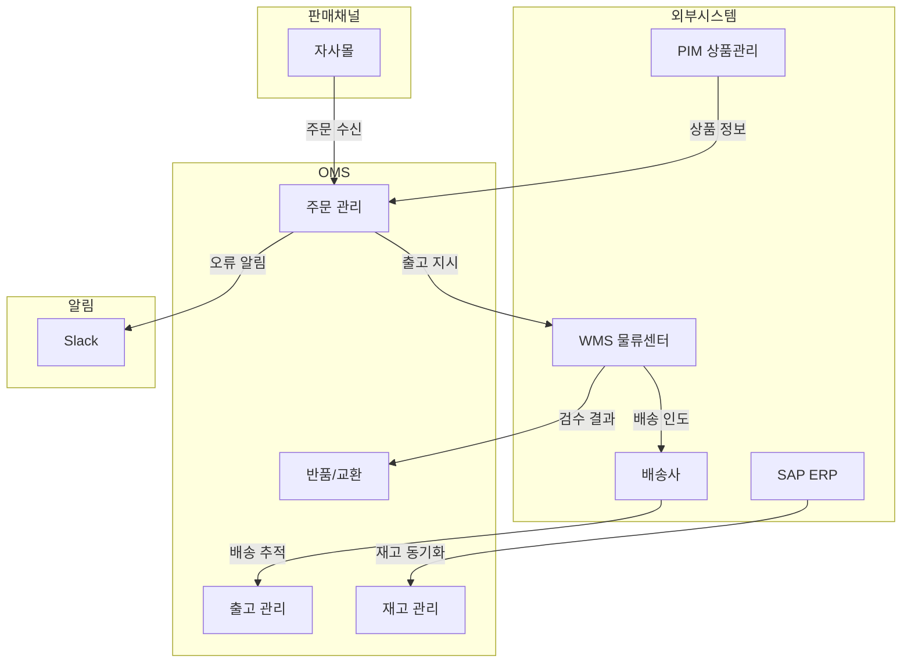

# 외부 시스템 연동

## 연동 시스템 개요

OMS는 단독으로 동작하지 않고, 여러 외부 시스템과 연동하여 주문의 전체 라이프사이클을 관리합니다.

## SAP ERP (OMS Adapter)

**역할**: 주문 동기화, 재고 마스터 관리, 출고 확인

| 항목 | 설명 |
|------|------|
| 연동 방식 | REST API + Kafka 이벤트 |
| 주요 기능 | 주문 동기화, 출고 확인, 재고 동기화 |
| 데이터 흐름 | 양방향 (SAP ↔ OMS) |

**OMS에서 SAP로:**
- 주문 상태 변경 알림
- 출고 완료 확인
- 클레임 처리 결과

**SAP에서 OMS로:**
- 신규 주문 수신
- 재고 수량 갱신 (온라인 재고)
- 상품 정보 업데이트

> **운영 참고**: SAP 연동이 지연되면 재고 동기화가 늦어질 수 있습니다. 이 경우 재고 변동 이력에서 최근 동기화 시점을 확인하세요.

## WMS (물류 관리 시스템)

**역할**: 물류센터의 피킹, 포장, 출고 실물 처리

| 항목 | 설명 |
|------|------|
| 연동 방식 | Kafka 이벤트 |
| 주요 기능 | 피킹/포장/출고, 반품 검수, 재고 실사 |
| 데이터 흐름 | 양방향 (WMS ↔ OMS) |

**OMS에서 WMS로:**
- 출고 요청 (피킹 지시)
- 반품 수거 요청

**WMS에서 OMS로:**
- 피킹 완료/거절
- 포장 완료
- 배송사 인도 (송장번호 포함)
- 반품 검수 결과 (등급 포함)

**법인별 WMS 연동 현황:**

| 법인 | WMS 연동 | 검수 방식 |
|------|---------|----------|
| KR (한국) | 연동 | WMS 자동 |
| JP (일본) | 연동 | WMS 자동 |
| US (미국) | 연동 | WMS 자동 |
| CA (캐나다) | 미연동 | 수동 (API) |
| TW (대만) | 미연동 | 수동 (API) |
| SG (싱가포르) | 미연동 | 수동 (API) |
| AU (호주) | 미연동 | 수동 (API) |

> **자가물류 법인 (OMS-1901)**: WMS 미연동 법인에서는 반품/교환 검수를 수동으로 처리해야 합니다. WMS 연동 법인에서 수동 검수를 시도하면 `Corporation uses WMS and cannot approve inspection manually` 오류가 발생합니다.

## PIM (상품 정보 관리)

**역할**: 상품 카탈로그 정보 제공

| 항목 | 설명 |
|------|------|
| 연동 방식 | REST API + Kafka 이벤트 |
| 주요 기능 | 상품 생성/수정 동기화 |
| 데이터 흐름 | PIM → OMS (단방향) |

**동기화되는 정보:**
- 상품코드, SKU, UPC
- 상품명 (다국어)
- 상품 유형 (단일/번들)
- 번들 구성품 정보
- 썸네일 이미지

> 상품 정보가 PIM에서 변경되면 Kafka 이벤트를 통해 OMS에 자동 반영됩니다. 수동 동기화가 필요한 경우 관리자 화면에서 브랜드별 **상품 동기화** 기능을 사용할 수 있습니다.

## Kafka (이벤트 스트리밍)

**역할**: 시스템 간 비동기 이벤트 전달

OMS는 모든 주요 상태 변경을 Kafka 이벤트로 발행하고, 외부 시스템의 이벤트를 수신합니다.

**주요 이벤트 토픽:**

| 도메인 | 수신 (update) | 발행 (updated) |
|--------|--------------|----------------|
| 주문 | 주문 생성/변경 수신 | 주문 상태 변경 알림 |
| 출고 | 출고 상태 변경 수신 | 출고 처리 결과 알림 |
| 반품 | 반품 상태 변경 수신 | 반품 처리 결과 알림 |
| 교환 | 교환 상태 변경 수신 | 교환 처리 결과 알림 |
| 재출고 | 재출고 상태 변경 수신 | 재출고 처리 결과 알림 |
| 매장 픽업 | 매장 픽업 변경 수신 | 매장 픽업 결과 알림 |
| 클레임 | 클레임 생성/변경 수신 | - |

> **운영 참고**: Kafka 이벤트 처리가 지연되면 화면에 표시되는 상태와 실제 상태가 일시적으로 불일치할 수 있습니다. 일반적으로 수 초 내에 자동 반영됩니다.

## 배송사

**역할**: 상품의 실물 배송 및 추적

| 배송사 | 코드 | 추적 지원 | 주요 커버리지 |
|--------|------|----------|-------------|
| CJ대한통운 | CJ | 가능 | 한국 국내 |
| DHL | DHL | 가능 | 국제 배송 |
| FedEx | FEDEX | 가능 | 미국/캐나다 |
| UPS | UPS | 가능 | 미국/캐나다 |
| 기타 | ETC | 불가 | - |

배송 추적 정보는 출고가 `배송 중(SHIPPED)` 상태가 되면 송장번호와 함께 추적 URL이 자동 생성됩니다.

## Slack (알림)

**역할**: 시스템 오류 및 중요 이벤트 알림

| 채널 | 용도 |
|------|------|
| notification-iic-oms | 시스템 오류, 처리 실패 알림 |
| notification-iic-oms-report | 운영 리포트 알림 |

> 시스템에서 예외가 발생하거나 중요한 처리가 실패하면 Slack 채널로 자동 알림이 전송됩니다. 알림을 받으면 해당 주문/출고 건을 OMS에서 확인하세요.
