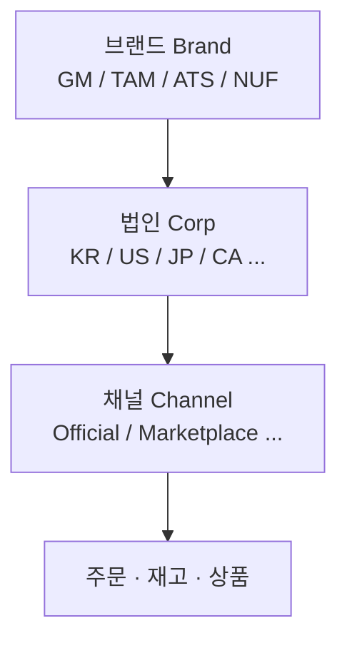
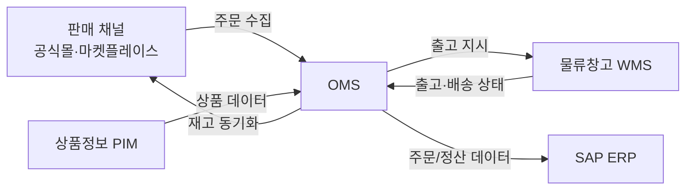

# 운영자가 알아야 할 기본 개념

OMS를 본격적으로 사용하기 전에, 시스템이 어떤 구조로 데이터를 나누고 다루는지 이해하면 모든 기능이 쉬워집니다. 이 페이지는 **브랜드·법인·채널 구조**, **권한 모델**, **외부 시스템 연동**을 큰 그림으로 설명합니다.

---

## 브랜드 · 법인 · 채널 구조

OMS의 모든 데이터(주문·재고·상품)는 아래 3단계로 구분됩니다.

| 구분 | 의미 | 예시 |
|------|------|------|
| **브랜드 (Brand)** | 상품을 판매하는 브랜드 | GENTLE MONSTER, TAMBURINS, ATIISSU, NUFLAAT |
| **법인 (Corp)** | 판매·정산이 이루어지는 국가 법인 | KR(한국), US(미국), JP(일본), CA(캐나다), TW, SG, AU |
| **채널 (Channel)** | 실제 판매가 일어나는 창구 | 공식몰(Official), 마켓플레이스(KAKAO·SSG·FARFETCH 등) |

화면 상단 헤더에서 **Brand & Corp**를 선택하면, 그 조합에 속한 데이터만 화면에 표시됩니다. 즉 "GM (KR)"을 선택하면 젠틀몬스터 한국 법인의 주문/재고만 보입니다. (자세한 전환 방법은 [화면 둘러보기](./screen-tour) 참고)

---

## 권한 모델 — 내가 볼 수 있는 데이터의 범위

:::warning 핵심 원칙
운영자는 **자신에게 부여된 브랜드 × 법인 조합의 데이터만** 조회·관리할 수 있습니다.
:::

예를 들어 "GM KR" 권한만 있는 사용자는 젠틀몬스터 한국 주문만 볼 수 있고, 일본(JP)이나 다른 브랜드의 주문은 보이지 않습니다. 권한이 필요하면 **권한 요청(Request Permission)**을 통해 관리자의 승인을 받아야 합니다.

권한은 두 가지로 구성됩니다.

- **접근 범위**: 어떤 브랜드 × 법인을 볼 수 있는가
- **역할(Role)**: 그 범위 안에서 무엇을 할 수 있는가 (조회만 가능 / 처리 가능 / 관리 가능)

역할의 종류와 권한 요청·승인 절차는 [사용자(User)](../user/user-list) 챕터에서 자세히 다룹니다.

---

## 외부 시스템과의 연동 (운영자가 알아둘 것)

OMS는 혼자 동작하지 않고, 여러 외부 시스템과 데이터를 주고받습니다. 운영 중 "주문이 안 들어와요", "재고가 안 맞아요", "송장이 늦게 떠요" 같은 현상은 대부분 이 연동 때문에 발생하므로 흐름을 알아두면 원인 파악이 쉽습니다.

| 외부 시스템 | 역할 | 운영자가 보게 되는 현상 |
|-------------|------|------------------------|
| **판매 채널** | 주문이 들어오는 곳 | 주문 수집은 주기적으로 일어나므로, 채널 주문이 OMS에 뜨기까지 시간이 걸릴 수 있음 |
| **WMS(물류창고)** | 피킹·포장·배송 수행 | 출고 상태(Picking/Packed/Shipped)는 창고에서 OMS로 전달됨 |
| **SAP(ERP)** | 정산·재무 | 주문 확정 시 SAP로 데이터 전송 |
| **PIM** | 상품 정보 원천 | 상품명·SKU 정보의 기준 |

:::note
연동 지연으로 인한 문제(주문 미수신, 재고 불일치 등)의 구체적 대응법은 [자주 겪는 상황 — 재고 불일치/동기화 지연](../use-cases/inventory-mismatch-sync-delay)에서 다룹니다.
:::

---

## 다음 단계

- [로그인과 권한](./login-and-roles) — 로그인하고 권한을 요청하는 방법
- [화면 둘러보기](./screen-tour) — 헤더·메뉴·공통 UI 익히기
- [용어집](./glossary) — 매뉴얼에 자주 나오는 용어 정리
