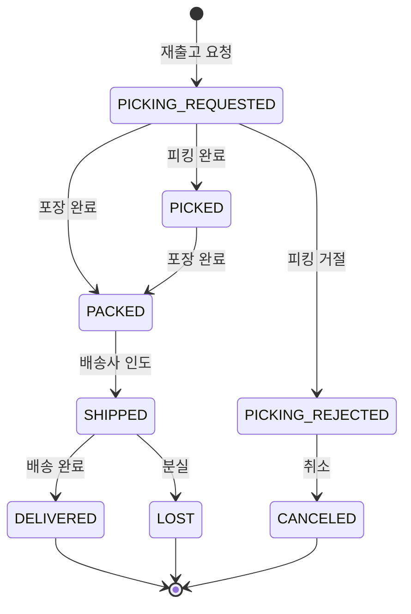

# 재출고 관리

## 재출고란?

재출고(Reshipment)는 **출고가 실패하거나 배송 중 분실된 경우** 동일한 상품을 다시 배송하는 프로세스입니다.

## 재출고가 발생하는 경우

| 원인 | 설명 |
|------|------|
| 피킹 거절 | WMS에서 재고 부족 등으로 피킹이 거절됨 |
| 배송 분실 | 배송 중 상품이 분실됨 |
| 교환 출고 실패 | 교환 건의 출고가 피킹 거절됨 |

## 재출고 조회

**검색 필터:**

| 필터 | 설명 |
|------|------|
| 날짜 범위 | 재출고 요청일 기준 |
| 채널 | 판매 채널 |
| 상태 | 진행 중 / 최종 완료 |

**재출고 상태:**

| 그룹 | 포함 상태 |
|------|-----------|
| 진행 중 | `PICKING_REQUESTED`, `PICKED`, `PACKED`, `SHIPPED` |
| 최종 완료 | `DELIVERED`, `LOST`, `CANCELED` |

## 재출고 생성 절차

### 일반 주문 재출고

1. 주문 상세 → 출고 건 확인
2. `피킹 거절(PICKING_REJECTED)` 또는 `분실(LOST)` 상태의 출고 확인
3. **재출고 클레임** 등록 (클레임 유형: `RESHIPMENT`)
4. 재출고(Reshipment) 건 자동 생성
5. WMS에 새 피킹 요청 → 배송 진행

### 교환 건 재출고

교환 출고(ExchangeShipment)가 피킹 거절된 경우:

1. 교환 상세 → 교환 출고 건 확인
2. `피킹 거절(PICKING_REJECTED)` 상태 확인
3. **재출고 요청** 클릭
4. 새로운 교환 출고 건이 생성되어 배송 재개

## 재출고 상태 흐름

## 재출고에서 할 수 있는 작업

| 작업 | 가능한 상태 | 설명 |
|------|------------|------|
| 출고 취소 | `PICKING_REJECTED` | 재출고 취소 |
| 분실 처리 | `SHIPPED` | 재출고 배송 중 분실 |
| 재재출고 | `LOST` | 분실된 재출고를 다시 클레임 접수 |

> **재출고 기능 확장 (OMS-1997, OMS-1998)**: 재출고에 대한 출고 취소, 분실 처리, 거절 관련 기능이 추가되었습니다. 재출고 배송 중 분실이 발생하면 `LOST` 상태로 전이되며, 재출고 클레임을 다시 접수할 수 있습니다.
