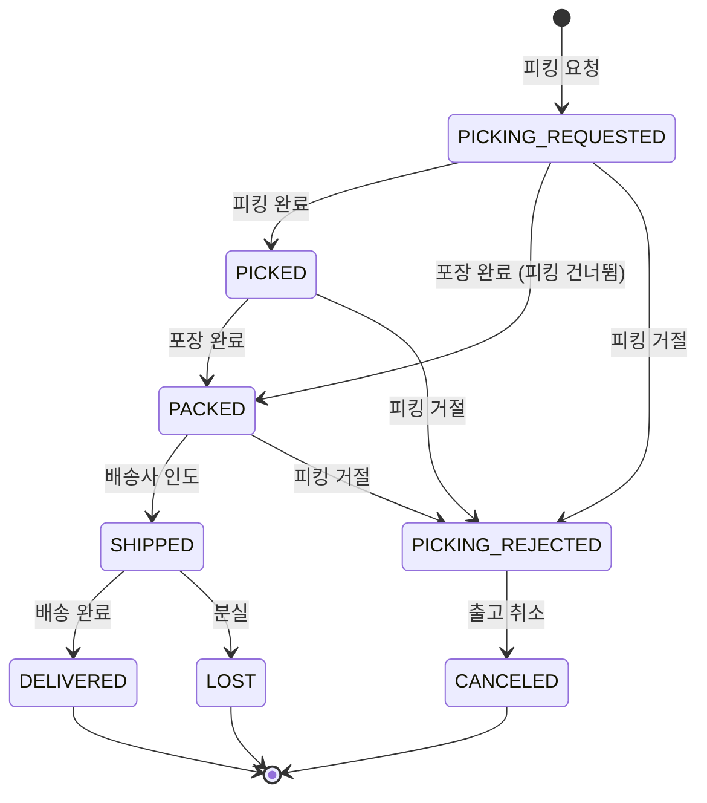

# 출고 조회 / 배송 추적

## 출고 목록 조회

주문 목록에서 출고 상태 필터를 사용하거나, 출고 번호로 직접 검색할 수 있습니다.

**검색 필터:**

| 필터 | 설명 | 입력 제한 |
|------|------|----------|
| 출고 번호 | 출고 건의 고유 번호 | 최대 100건 |
| 출고 상태 | 출고 진행 상태 | 복수 선택 가능 |
| 채널 | 판매 채널 | 권한 범위 내에서만 |
| 날짜 범위 | 출고 요청일 기준 | 완료 건 조회 시 필수 |

## 출고 상세 정보

주문 상세 화면에서 해당 주문에 연결된 출고 건들을 확인할 수 있습니다.

**출고별 표시 정보:**

| 항목 | 설명 |
|------|------|
| 출고 번호 | OMS 출고 고유 번호 |
| WMS 번호 | 물류 센터 관리 번호 |
| 출고 상태 | 현재 배송 진행 상태 |
| 이벤트 | 최근 처리 이벤트 |
| 수령인 | 배송 받을 사람 정보 |
| 배송사 | CJ, DHL, FedEx, UPS, ETC |
| 송장번호 | 배송 추적 번호 |
| 추적 URL | 배송사 추적 링크 |
| 출고 일시 | 배송사에 인도된 시각 |
| 취소 사유 | 취소/거절 시 사유 |

## 배송 추적

출고 상태가 `배송 중(SHIPPED)` 이상일 때 배송사별 추적 URL이 제공됩니다.

**배송사별 추적:**

| 배송사 | 추적 방법 |
|--------|----------|
| CJ대한통운 | 송장번호로 CJ 홈페이지 추적 |
| DHL | DHL Express 추적 |
| FedEx | FedEx 추적 |
| UPS | UPS 추적 |
| 기타(ETC) | 추적 URL 미제공 |

> **참고**: 추적 URL은 출고 상세 화면에서 직접 클릭하여 확인할 수 있습니다.

## 분할 배송 확인

하나의 주문에 여러 출고 건이 있을 수 있습니다.

- 주문 상세 → **관련 출고 목록** 섹션에서 모든 출고 건 확인
- 각 출고 건별 상품 목록과 수량 표시
- 각 출고 건의 배송 상태를 개별적으로 추적

## 출고 상태 흐름

> **참고**: 일부 물류 센터에서는 피킹과 포장을 한 번에 처리하므로 `PICKED` 단계를 건너뛸 수 있습니다.

## 출고에서 할 수 있는 작업

| 작업 | 가능한 상태 | 설명 |
|------|------------|------|
| 출고 취소 | `PICKING_REJECTED` | 피킹 거절 건에 대해 출고 취소 |
| 분실 처리 | `SHIPPED` | 배송 중 분실 기록 |
| 오프라인 디스패치 | 채널별 설정 | 비표준 채널의 오프라인 출고 처리 |

> **출고 분실 처리 (OMS-1911)**: 배송 중 상태의 출고에 대해 분실 처리가 가능합니다. 분실 후 재배송이 필요하면 재출고 클레임을 접수합니다.
