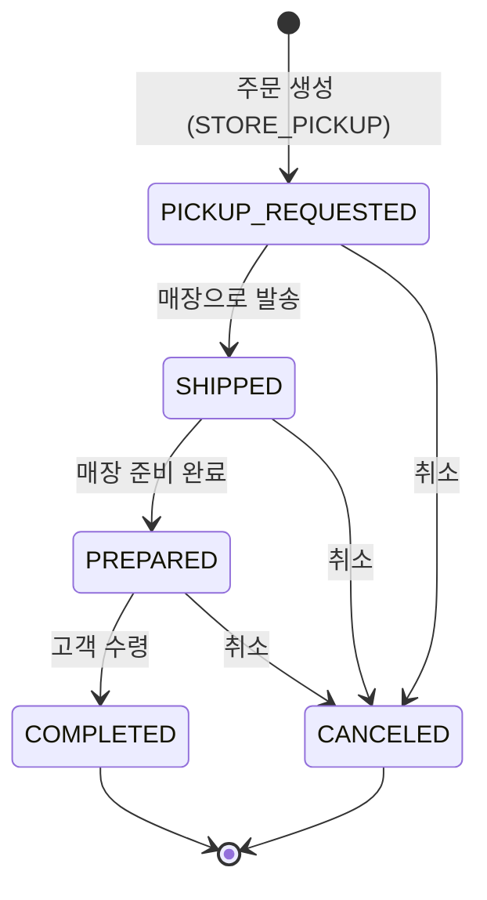

# 매장 픽업 관리

## 매장 픽업이란?

매장 픽업(Store Pickup)은 고객이 온라인에서 주문하고 **매장에서 직접 상품을 수령**하는 방식입니다. 주문 생성 시 수령 방법이 `STORE_PICKUP`으로 설정됩니다.

## 매장 픽업 조회

주문 목록에서 수령 방법 필터를 `매장 픽업(STORE_PICKUP)`으로 설정하거나, 매장 픽업 상태 필터를 사용하여 조회합니다.

**필터:**

| 필터 | 설명 |
|------|------|
| 수령 방법 | `STORE_PICKUP` 선택 |
| 매장 픽업 상태 | 진행 상태별 필터링 |
| 채널 | 판매 채널 |
| 날짜 범위 | 주문일 기준 |

> **매장픽업 상태 필터 (OMS-2022)**: 매장 픽업 주문의 진행 상태별로 필터링할 수 있습니다.

> **수령 방법 필터 (OMS-2017)**: 배송 주문과 매장 픽업 주문을 구분하여 조회할 수 있습니다.

## 매장 픽업 상태

| 상태 | 코드 | 설명 |
|------|------|------|
| 픽업 요청 | PICKUP_REQUESTED | 주문 생성 시 자동 생성 |
| 발송 | SHIPPED | 물류센터에서 매장으로 상품 발송 |
| 준비 완료 | PREPARED | 매장에서 고객 수령 준비 완료 |
| 완료 | COMPLETED | 고객이 매장에서 수령 완료 |
| 취소 | CANCELED | 매장 픽업 취소 |

## 매장 픽업 처리 절차

### Step 1. 매장 픽업 요청 확인

고객이 주문 시 수령 방법을 `매장 픽업`으로 선택하면, 매장 픽업 건이 자동 생성됩니다.

- 주문 상세 → **관련 매장 픽업** 섹션에서 확인
- 초기 상태: `픽업 요청(PICKUP_REQUESTED)`

### Step 2. 매장으로 상품 발송

물류센터에서 매장으로 상품을 발송합니다.

- 상태 변경: `PICKUP_REQUESTED` → `SHIPPED`
- B2B 출고 방식으로 처리

### Step 3. 매장 준비 완료

매장에서 상품을 수령하고 고객 인도 준비를 완료합니다.

- 상태 변경: `SHIPPED` → `PREPARED`
- 고객에게 수령 가능 알림

### Step 4. 고객 수령 완료

고객이 매장을 방문하여 상품을 수령합니다.

- 상태 변경: `PREPARED` → `COMPLETED`
- 매장 픽업 완료 → 주문 완료 처리

## 매장 픽업 주문의 이력 확인

주문 이력 조회에서 매장 픽업 관련 이벤트도 함께 확인할 수 있습니다.

> **이력 확장 (OMS-1996)**: 매장 픽업 이력 정보가 주문 이력에 추가되었습니다.

> **매장 픽업 기능 (OMS-1913 ~ OMS-1917)**: 매장 픽업 엔티티 및 이벤트 처리가 새로 개발되었습니다.
