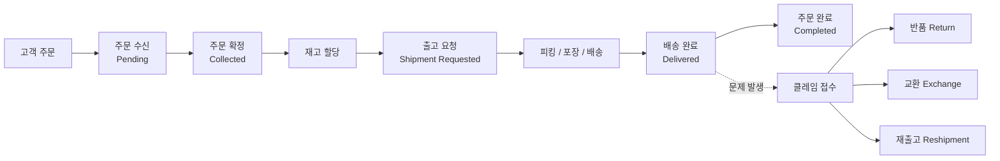

# OMS 운영 매뉴얼

IIC OMS(Order Management System) 운영자를 위한 공식 사용 매뉴얼입니다. 이 문서는 **화면(메뉴) 순서대로** 구성되어 있어, 좌측 메뉴를 보면서 그대로 따라 할 수 있습니다.

:::tip 처음 오셨나요?
[**시작하기**](./getting-started/overview) 챕터부터 읽으세요. 로그인 방법, 권한 개념, 화면 구성, 기본 용어를 먼저 익히면 나머지 기능이 훨씬 쉽게 이해됩니다.
:::

---

## OMS란?

OMS는 **고객이 주문하는 순간부터 상품이 도착하거나 반품·교환이 끝날 때까지의 전 과정**을 관리하는 시스템입니다. 여러 브랜드(GENTLE MONSTER, TAMBURINS, ATIISSU, NUFLAAT 등)와 여러 법인(KR, US, JP, CA 등), 여러 판매 채널의 주문을 한 화면에서 통합 관리합니다.

| 도메인 | 무엇을 관리하나 |
|--------|----------------|
| 주문 (Order) | 고객이 상품을 구매한 건 |
| 출고 (Shipment) | 상품을 포장해 배송하는 건 |
| 매장픽업 (Store Pickup) | 고객이 매장에서 직접 수령하는 건 |
| 반품 (Return) | 상품을 돌려받고 환불하는 건 |
| 교환 (Exchange) | 상품을 돌려받고 다른 상품을 보내는 건 |
| 재출고 (Reshipment) | 출고가 실패/분실된 건을 다시 보내는 건 |
| 재고 (Stock) | 채널별 판매 가능 수량을 관리 |
| 상품 (Product) | 상품 마스터·가격·이미지·채널 노출 관리 |
| 프로모션 (Promotion) | GWP·패키징 혜택 등 판촉 설정 |

---

## 전체 흐름 한눈에 보기

주문은 **Pending(수신) → Collected(확정) → Shipment Requested(출고요청) → Delivered(배송완료) → Completed(완료)** 순서로 진행됩니다. 각 상태에서 가능한 작업(취소·수령인 수정·클레임 등)이 다르므로, 상태의 의미를 이해하는 것이 운영의 핵심입니다. 자세한 내용은 [상태 코드표](./reference/status-codes)를 참고하세요.

---

## 이 매뉴얼 사용법

이 매뉴얼은 OMS의 **좌측 메뉴 구조 그대로** 챕터를 나눴습니다.

| 챕터 | 내용 |
|------|------|
| [시작하기](./getting-started/overview) | 로그인, 권한, 화면 구성, 용어 |
| [주문 (Order)](./order/dashboard) | 대시보드, 주문 조회·취소, 반품·교환·재출고, 매장픽업, Export |
| [재고 (Stock)](./stock/overview) | 재고 개념, 채널 분배, 안전재고·프리오더, 변동 이력 |
| [상품 (Product)](./product/product-list) | 상품 마스터, 번들, 일괄 업로드, 채널 상품 |
| [채널 (Channel)](./channel/channel-list) | 채널 조회·등록·설정 |
| [프로모션 (Promotion)](./promotion/promotion-list) | 프로모션 등록·수정·조회 |
| [사용자 (User)](./user/user-list) | 계정·권한 요청·승인 관리 |
| [자주 겪는 상황](./use-cases/delivery-lost) | 분실·오배송·재고 불일치 등 시나리오별 대응 |
| [레퍼런스](./reference/status-codes) | 상태 코드, 필드 정의, 에러 메시지, 브랜드·채널 |

:::note 화면 언어 안내
OMS 화면의 버튼·메뉴·항목명은 **영어**로 표기됩니다. 이 매뉴얼은 한국어로 설명하되, 화면에서 찾아야 하는 버튼/항목은 `"Bulk Cancel"`처럼 **실제 영어 표기 그대로** 인용합니다.
:::
