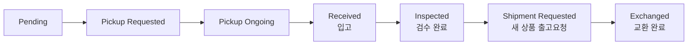

# 교환 처리 (Exchange)

교환은 **기존 상품을 회수하고 새 상품을 발송**하는 클레임입니다. 좌측 메뉴 **Order → Exchange List**에서 조회하고, 주문 상세의 **EXCHANGE 탭**에서 처리합니다. 반품과 비슷하지만 마지막에 **새 상품 발송** 단계가 추가됩니다.

---

## 교환 상태 흐름

| 상태 | 의미 | 가능한 작업 |
|------|------|-------------|
| **Pending** | 교환 접수, 회수 대기 | 수령인 수정, 취소 |
| **Pickup Requested / Ongoing** | 기존 상품 회수 단계 | 수령인 수정, 취소 |
| **Received** | 기존 상품 입고 | 검수(Refund Grading), 취소 |
| **Inspected** | 검수 완료 | 새 상품 출고요청(Request Shipment) |
| **Shipment Requested** | 새 상품 출고 진행 | (대기) |
| **Exchanged** | 새 상품 발송 완료 | (종료) |

---

## 교환 처리 절차

주문 상세 화면의 **EXCHANGE 탭**에서 교환 카드를 펼쳐 처리합니다.

### 1. 회수 단계

- 반품과 동일하게 기존 상품을 회수합니다(Pickup Requested → Ongoing → Received).
- 새 상품을 받을 주소를 바꿔야 하면 **"Edit Recipient Info"**로 수정합니다. (출고 전 단계에서만 가능)

### 2. 검수 (Refund Grading)

기존 상품이 입고되어 **Received** 상태가 되면 검수합니다.

<video controls width="100%" style={{maxWidth: '900px', borderRadius: '8px'}}>
  <source src="/oms_manual/video/iic_oms_exchange_grading.mov" />
  브라우저가 영상을 지원하지 않습니다.
</video>

1. **"Refund Grading"** 버튼을 클릭합니다.
2. 회수된 상품의 **등급(A/B/C)**을 수량마다 지정합니다. (등급 기준은 [반품 검수](./return#3-입고-확인-후-검수-및-환불-refund)와 동일)
3. 검수를 확정하면 상태가 **Inspected**로 바뀝니다.

### 3. 새 상품 출고 요청 (Request Shipment)

1. 상태가 **Inspected**가 되면 **"Request Shipment"** 버튼이 나타납니다.
2. 버튼을 눌러 **새 상품(Resend)**의 출고를 요청합니다.
3. EXCHANGE 탭의 **Resend Shipment Information**에서 새 상품의 출고번호·송장번호·상태를 확인할 수 있습니다.
4. 새 상품 발송이 완료되면 상태가 **Exchanged**가 됩니다.

---

## 교환 취소

검수가 시작되기 전까지는 교환을 취소할 수 있습니다.

1. EXCHANGE 탭에서 **"Cancel Exchange"** 버튼을 클릭합니다.
2. 취소 가능 상태: **Pending / Pickup Requested / Pickup Ongoing / Received**
3. **Inspected** 이후(검수 완료·새 상품 출고 진행)에는 취소할 수 없습니다.

**Exchange List**에서 여러 건을 선택해 **"Bulk Cancel"**로 일괄 취소할 수도 있습니다.

:::note
다양한 교환 상황별 대응은 [자주 겪는 상황 — 교환 시나리오](../use-cases/exchange-scenarios)를 참고하세요.
:::
