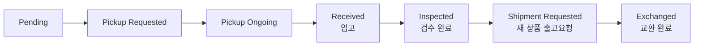

# 교환 처리 (Exchange)

교환은 **기존 상품을 회수하고 새 상품을 발송**하는 클레임입니다. 좌측 메뉴 **Order → Exchange List**에서 조회하고, 주문 상세의 **EXCHANGE 탭**에서 처리합니다. 반품과 비슷하지만 마지막에 **새 상품 발송** 단계가 추가됩니다.

---

## 교환 상태 흐름

```mermaid
graph LR
    A[Pending] --> B[Pickup Requested]
    B --> C[Pickup Ongoing]
    C --> D[Received<br/>입고]
    D --> E[Inspected<br/>검수 완료]
    E --> F[Shipment Requested<br/>새 상품 출고요청]
    F --> G[Exchanged<br/>교환 완료]
```

| 상태 | 의미 | 가능한 작업 |
|------|------|-------------|
| **Pending** | 교환 접수, 회수 대기 | 수령인 수정, 취소 |
| **Pickup Requested / Ongoing** | 기존 상품 회수 단계 | 수령인 수정, 취소 |
| **Received** | 기존 상품 입고 | 검수(Refund Grading), 취소 |
| **Inspected** | 검수 완료 | 새 상품 출고요청(Request Shipment) |
| **Shipment Requested** | 새 상품 출고 진행 | (대기) |
| **Exchanged** | 새 상품 발송 완료 | (종료) |

---

## 교환 등록 시 Pickup Option 선택

주문 상세에서 **Register Claim → Claim Type을 Exchange**로 선택하면 **Pickup Option**이 함께 나타납니다(Return도 동일). 이 옵션으로 OMS가 기존 상품의 회수(픽업) 지시를 보낼지 여부를 결정합니다.

| Pickup Option | 동작 | 사용 시점 |
|---------------|------|-----------|
| **Request Pickup** | 회수(픽업) 지시를 진행합니다. | 일반적인 교환 — 기존 상품 회수가 필요한 경우 |
| **Do Not Request Pickup** | 픽업 없이 교환을 생성합니다. | 이미 수거가 완료됐거나 WMS로부터 수거 상태를 수신할 수 있는 경우 |

**Do Not Request Pickup**을 선택하면 이미 수거된 **Tracking Information(반송장 정보 — Carrier·송장번호)**을 입력합니다. 주로 다음과 같은 경우에 사용합니다.

- 이미 수기로 WMS에 기존 상품이 입고·처리 완료되어, 시스템상으로만 교환을 진행하면 되는 경우
- 고객이 직접 반송을 진행한 경우
- 입고된 제품이 신청한 제품과 다를 때, 기존 교환을 취소하고 입고된 제품을 재선택해 교환을 신청하는 경우

---

## 패키지 단독 교환

패키지(케이스 등) 불량만 발생한 경우, **본품과 분리해 패키지만 교환**할 수 있습니다.

- **Register Claim → Exchange**에서 교환 대상 제품을 선택할 때, 번들 구성품 중 **패키지만 선택**하면 됩니다.
- 본품은 회수·교환 대상에서 제외되고, 패키지만 회수·재출고됩니다.

---

## 교환 처리 절차

주문 상세 화면의 **EXCHANGE 탭**에서 교환 카드를 펼쳐 처리합니다.

### 1. 회수 단계

- 반품과 동일하게 기존 상품을 회수합니다(Pickup Requested → Ongoing → Received).
- 새 상품을 받을 주소를 바꿔야 하면 **"Edit Recipient Info"**로 수정합니다. (출고 전 단계에서만 가능)

### 2. 검수 (Refund Grading)

기존 상품이 입고되어 **Received** 상태가 되면 검수합니다.

:::note
WMS를 통하지 않는 '자가물류' 를 하는 Brand & Corp 에만 해당되며, WMS 를 통해 입고정보를 수신받는 경우 Grading 과 함께 자동 확정 처리됩니다.
:::

<video controls width="100%" style={{maxWidth: '900px', borderRadius: '8px'}}>
  <source src="/oms_manual/video/iic_oms_exchange_grading.mov" />
  브라우저가 영상을 지원하지 않습니다.
</video>

1. **"Inspect"** 버튼을 클릭합니다.
2. 회수된 상품의 **등급(A/B/C)**을 수량마다 지정합니다. (등급 기준은 [반품 검수](./return#3-입고-확인-후-검수-및-환불-refund)와 동일)
3. 검수를 확정하면 상태가 **Inspected**로 바뀝니다.

### 3. 새 상품 출고 요청 (Request Shipment)

[재출고 재고가 존재할 경우]

1. Inspected 상태에서 재출고 할 재고가 존재한다면 자동으로 새상품 출고 요청이 진행됩니다.
2. EXCHANGE 탭의 **Resend Shipment Information**에서 새 상품의 출고번호·송장번호·상태를 확인할 수 있습니다.
3. 새 상품 발송이 완료되면 상태가 **Exchanged**가 됩니다.

[재출고 재고가 존재하지 않을 경우]

1. 상태가 **Inspected**로 머물러 있고 **"Request Shipment"** 버튼이 나타납니다.
2. 버튼을 눌러 새 상품의 출고를 요청합니다.
    - 재고가 없을 경우 '재고 부족' 관련한 오류 알림이 발생합니다.
3. EXCHANGE 탭의 **Resend Shipment Information**에서 새 상품의 출고번호·송장번호·상태를 확인할 수 있습니다.
4. 새 상품 발송이 완료되면 상태가 **Exchanged**가 됩니다.

:::note
새 상품 출고요청은 상태와 상관없이 진행이 가능합니다.
즉, 제품이 입고되기 전 'Request Shipment' 버튼을 통해 출고를 우선 요청할 수 있습니다. 
버튼은 **[Pickup Requested, Pickup Ongoing, Received]** 상태에서 노출됩니다.
:::

#### 재고가 없어 Inspected로 머무는 경우 — 자동 할당·출고

재고가 없어 `Inspected` 상태로 홀딩된 건은 **미할당 출고**로 간주되어, **하루 한 번 마감재고 수신·분배 시 자동으로 할당된 뒤 출고**됩니다. 재고가 들어올 때마다 Request Shipment를 수기로 누를 필요가 없습니다.

:::note 교환 출고 재고할당 기준
교환 출고 재고할당의 기준은 **채널에 분배된 재고**입니다.

- **일반 출고**가 미할당될 경우 → 마감재고 수신 후 채널에 분배되기 전 수량으로 우선 할당
- **교환 출고**가 미할당될 경우 → 마감재고를 채널별로 분배한 재고 수량으로 할당 (분배 재고가 없으면 미출고)
:::

:::warning 교환·재출고는 채널 재고를 사용합니다
주문에 의한 출고가 아닌 **교환·불량·분실 등으로 인한 재출고도 채널 재고를 사용**합니다. 채널 재고가 없으면 재출고가 불가하므로, [Stock Transfer](../stock/overview#stock-transfer)로 재고를 이동받아 채널 재고를 채운 뒤 진행해야 합니다.
:::

---

## 교환 취소

검수가 시작되기 전까지는 교환을 취소할 수 있습니다.

1. EXCHANGE 탭에서 **"Cancel Exchange"** 버튼을 클릭합니다.
2. 취소 가능 상태: **Pending / Pickup Requested / Pickup Ongoing / Received**
3. **Inspected** 이후(검수 완료·새 상품 출고 진행)에는 취소할 수 없습니다.

**Exchange List**에서 여러 건을 선택해 **"Bulk Cancel"**로 일괄 취소할 수도 있습니다.

:::note
다양한 교환 상황별 대응은 [자주 겪는 상황 — 교환 시나리오](../use-cases/exchange-scenarios)를 참고하세요.
:::
