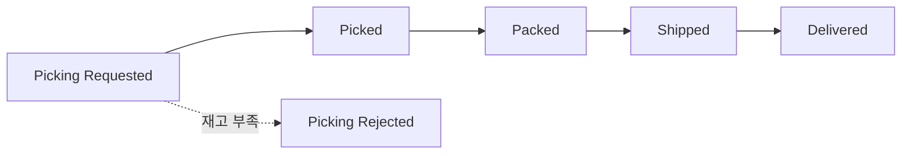

# 재출고 처리 (Reshipment)

재출고는 **출고가 실패하거나 분실된 건을 다시 발송**하는 것입니다. 고객에게 추가 부담 없이 같은 상품을 다시 보냅니다. 좌측 메뉴 **Order → Reshipment List**에서 조회하고, 주문 상세의 **RESHIPMENT 탭**에서 처리합니다.

---

## 재출고가 발생하는 경우

| 발생 원인 | 어떻게 진행되나 |
|-----------|-----------------|
| **피킹 거부(Picking Rejected)** | 재고 부족 등으로 출고 실패 → 재고 확보 후 재출고 |
| **배송 분실(Lost)** | 배송 중 분실 → 재출고 선택 시 새 출고 생성 |

---

## 재출고 상태 흐름

재출고는 일반 출고와 동일한 상태 흐름을 따릅니다.

---

## 재출고 처리 절차

주문 상세 화면의 **RESHIPMENT 탭**에서 재출고 카드를 펼쳐 처리합니다.

### 다시 보내기 (Re-Ship)

1. 재출고 상태가 **Picking Rejected**(피킹 거부)이면 **"Re-Ship"** 버튼이 나타납니다.
2. 버튼을 눌러 재고를 확보한 상태로 다시 출고를 요청합니다.

### 수령인 정보 수정 (Edit Recipient Info)

배송 주소·연락처를 바꿔야 하면 **"Edit Recipient Info"** 버튼으로 수정합니다.

### 재출고 취소 (Cancel Reshipment)

1. 상태가 **Picking Requested**일 때 **"Cancel Reshipment"** 버튼으로 취소할 수 있습니다.
2. 버튼에 **"(WMS Confirm needed)"** 표시가 있으면, 창고(WMS)의 확인이 필요한 작업이라는 의미입니다.

:::note
피킹 거부 → 재출고 전체 흐름은 [자주 겪는 상황 — 출고 거부와 재출고](../use-cases/shipment-rejection-reshipment)에서 단계별로 다룹니다.
:::
