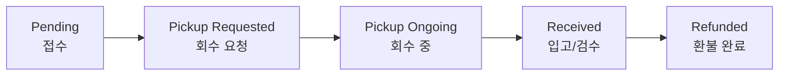

# 반품 처리 (Return)

반품은 **상품을 회수하고 환불**하는 클레임입니다. 좌측 메뉴 **Order → Return List**에서 반품 건을 조회하고, 주문 상세의 **RETURN 탭**에서 개별 건을 처리합니다.

<video controls width="100%" style={{maxWidth: '900px', borderRadius: '8px'}}>
  <source src="/oms_manual/video/iic_oms_return.mov" />
  브라우저가 영상을 지원하지 않습니다.
</video>

---

## 반품 상태 흐름

| 상태 | 의미 | 가능한 작업 |
|------|------|-------------|
| **Pending** | 반품 접수, 회수 대기 | 회수 요청, 취소 |
| **Pickup Requested** | 회수 지시 전달됨 | 취소 |
| **Pickup Ongoing** | 회수 진행 중 | 취소 |
| **Received** | 입고 및 검수 완료 | 환불(검수 등급에 따라) |
| **Refunded** | 환불 완료 | (종료) |
| **Canceled** | 반품 취소됨 | (종료) |

**반품 방법(Return Method)**은 두 가지입니다.

- **PARCEL**: 택배로 회수(회수 지시 필요)
- **IN_STORE**: 고객이 매장에 직접 반납

---

## 반품 등록 시 Pickup Option 선택

주문 상세에서 **Register Claim → Claim Type을 Return**으로 선택하면 **Pickup Option**이 함께 나타납니다(Exchange도 동일). 이 옵션으로 OMS가 회수(픽업) 지시를 보낼지 여부를 결정합니다.

| Pickup Option | 동작 | 사용 시점 |
|---------------|------|-----------|
| **Request Pickup** | 회수(픽업) 지시를 진행합니다. | 일반적인 반품 — 회수가 필요한 경우 |
| **Do Not Request Pickup** | 픽업 없이 반품을 생성합니다. | 이미 수거가 완료됐거나 WMS로부터 수거 상태를 수신할 수 있는 경우 |

**Do Not Request Pickup**을 선택하면 이미 수거된 **Tracking Information(반송장 정보 — Carrier·송장번호)**을 입력합니다. 주로 다음과 같은 경우에 사용합니다.

- 이미 수기로 WMS에 제품이 입고·처리 완료되어, 시스템상으로만 환불하면 되는 경우
- 고객이 직접 반송을 진행한 경우
- 입고된 제품이 신청한 제품과 다를 때, 기존 반품을 취소하고 입고된 제품을 재선택해 반품을 신청하는 경우

:::tip Do Not Request Pickup vs. Force Refund
둘 다 **픽업 요청 없이 반품을 생성**한다는 점은 같지만, **WMS에서 반품 처리 상태를 수신할 수 있는지**가 다릅니다.

- **수신 가능** → **Do Not Request Pickup** + Tracking Information 입력 (입고·검수 후 환불)
- **수신 불가** → **Force Refund**(강제 환불, WMS 상태 수신 없이 즉시 환불)
:::

---

## 반품 처리 절차

### 1. 회수 요청 (Request Pickup)

1. 반품 상태가 **Pending**일 때 **"Request Pickup"** 버튼을 클릭합니다.
2. 회수 지시가 전달되고 상태가 **Pickup Requested**로 바뀝니다.

:::note
채널에서 접수한 반품은 'Pending' 으로 인입되고 OMS 에서 접수한 반품은 즉시 'Pickup Requested' 상태가 되며 wms 로 전송됩니다.
:::

### 2. 수령인 정보 수정 (Edit Recipient Info)

회수 주소·연락처를 변경해야 하면 **"Edit Recipient Info"** 버튼으로 수정합니다. (회수 진행 전 단계에서만 가능)

### 3. 입고 확인 후 검수 및 환불 (Refund)

상품이 창고에 입고되면 상태가 **Received**가 됩니다. 이때 **검수 등급(Grade)**을 매긴 뒤 환불합니다.

:::note
WMS를 통하지 않는 '자가물류' 를 하는 Brand & Corp 에만 해당되며, WMS 를 통해 입고정보를 수신받는 경우 Grading 과 함께 자동 확정 처리됩니다.
:::

<video controls width="100%" style={{maxWidth: '900px', borderRadius: '8px'}}>
  <source src="/oms_manual/video/iic_oms_return_grading.mov" />
  브라우저가 영상을 지원하지 않습니다.
</video>

1. RETURN 탭의 **Product Inspection Result(검수 결과)** 영역에서 회수된 상품 **수량마다 등급**을 선택합니다.

   | 등급 | 의미 | 처리 |
   |------|------|------|
   | **A** | 재판매 가능(이상 없음) | 정상 재고로 복귀 |
   | **B** | 경미한 하자 | 별도 재고 풀로 분류 |
   | **C** | 판매 불가(손상) | 폐기 |

   - 같은 등급을 한 번에 적용하는 단축 버튼(A/B/C)과 초기화 버튼을 사용할 수 있습니다.
2. **모든 수량에 등급을 지정**해야 환불을 진행할 수 있습니다.
3. **"Refund"** 버튼을 눌러 환불을 확정합니다.

:::warning 검수 없이 즉시 환불해야 할 때
심각한 하자 등으로 검수 없이 바로 환불해야 하는 경우 **강제 환불(Force Refund)**로 처리합니다. 이런 건은 반품 카드에 **"FORCE REFUND"** 배지가 표시됩니다.
:::

---

## 반품 취소

회수가 완료되기 전이라면 반품을 취소할 수 있습니다.

1. RETURN 탭에서 **"Cancel Return"** 버튼을 클릭합니다.
2. 확인 시 반품이 취소됩니다.

- **PARCEL**: Pending / Pickup Requested / Pickup Ongoing 단계에서 취소 가능
- **IN_STORE**: Pending / Pickup Requested 단계에서만 취소 가능

---

## 여러 건 일괄 취소

**Return List**에서 여러 반품 건을 선택해 **"Bulk Cancel"**로 한 번에 취소할 수 있습니다(취소 가능 상태인 건만). 절차는 [주문 취소 — 일괄 취소](./order-cancel#방법-1--목록에서-여러-건-일괄-취소-bulk-cancel)와 동일합니다.

:::note
부분 검수·부분 환불 등 복합 상황은 [자주 겪는 상황 — 부분 검수 환불](../use-cases/partial-inspection-refund)을 참고하세요.
:::
