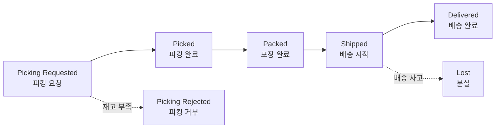

# 출고와 배송 추적

출고(Shipment)는 상품을 피킹·포장해 고객에게 배송하는 과정입니다. 실제 피킹·포장·배송은 물류창고(WMS)에서 수행하며, 그 진행 상태가 OMS로 전달되어 표시됩니다.

---

## 출고 상태 흐름

| 상태 | 의미 | 운영자가 할 일 |
|------|------|----------------|
| **Picking Requested** | WMS에 피킹 지시 전달됨 | 필요 시 출고 취소 가능(WMS 확인 필요) |
| **Picking Rejected** | 재고 부족 등으로 피킹 실패 | 재출고(Reshipment) 또는 주문 취소 |
| **Picked / Packed** | 피킹·포장 완료 | 대기(취소 불가) |
| **Shipped** | 배송 시작(송장 발급) | 배송 추적, 사고 시 분실 처리 |
| **Delivered** | 배송 완료 | 완료. 이후 반품/교환 가능 |
| **Lost** | 배송 중 분실 | 강제 환불 또는 재출고 |

전체 상태별 가능한 작업은 [상태 코드표](../reference/status-codes)에 정리되어 있습니다.

---

## 배송 추적

주문 상세 ORDER 탭의 **출고 정보** 영역에서 **출고번호(Shipment No)**, **송장번호(Tracking No)**, **현재 출고 상태**를 확인할 수 있습니다. 목록 화면에서도 Tracking No 컬럼으로 빠르게 확인됩니다.

송장번호가 발급되면(Shipped) 판매 채널로도 전달되어, 고객이 자신의 주문 내역에서 배송 조회를 할 수 있습니다.

---

## 피킹 거부(Picking Rejected) 처리

재고 부족 등으로 창고에서 피킹이 거부되면 출고 상태가 **Picking Rejected**가 됩니다. 이때 두 가지 선택이 있습니다.

- **Re-Ship(재출고)**: 재고를 확보해 다시 출고 → [재출고](./reshipment)
- **주문 취소**: 더 이상 출고가 불가능하면 취소 → [주문 취소](./order-cancel)

---

## 분실(Lost) 처리

배송 중 상품이 분실된 경우 처리 방법입니다.

<video controls width="100%" style={{maxWidth: '900px', borderRadius: '8px'}}>
  <source src="/oms_manual/video/iic_oms_lost.mov" />
  브라우저가 영상을 지원하지 않습니다.
</video>

1. 분실은 출고 상태가 **Shipped**일 때만 처리할 수 있습니다.
2. 해당 출고를 **Lost(분실)**로 표시합니다.
3. 이후 처리 방향을 선택합니다.
   - **재출고(Reshipment)**: 같은 상품을 다시 발송 (고객 추가 부담 없음)
   - **강제 환불(Force Refund)**: 재발송 없이 환불

:::note
분실 건의 단계별 대응은 [자주 겪는 상황 — 배송 분실](../use-cases/delivery-lost)에서 자세히 다룹니다.
:::
