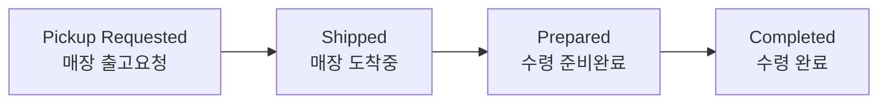

# 매장픽업 (Store Pickup)

매장픽업은 **고객이 매장에서 직접 상품을 수령**하는 주문입니다. 택배 배송 대신 창고에서 매장으로 상품을 보내고, 고객이 매장을 방문해 수령합니다.

목록·상세에서 수령방법(Receive Method)이 **보라색 "Store Pickup"** 칩으로 표시되어 일반 배송 주문과 구분됩니다. 대시보드 ORDER 탭의 **Store Pickup** 영역에서 현황을 모아 볼 수 있습니다.

---

## 매장픽업 상태 흐름

| 상태 | 의미 | 취소 가능 |
|------|------|:---------:|
| **Pickup Requested** | 매장으로 보낼 상품 준비 | ✅ |
| **Shipped** | 창고 → 매장 이동 완료 | ✅ |
| **Prepared** | 매장 입고, 고객 수령 대기 | ✅ |
| **Completed** | 고객 수령 완료 | ❌ (종료) |
| **Canceled** | 픽업 취소됨 | ❌ (종료) |

:::note
매장픽업은 택배 송장이 없습니다. 배송 추적 대신 **매장 도착(Shipped) → 수령 준비(Prepared) → 수령 완료(Completed)**로 진행 상태를 관리합니다.
:::

---

## 처리 방법

매장픽업 주문도 일반 주문과 동일하게 **Order List**에서 조회하고 주문번호로 상세를 확인합니다.

- 검색 시 **Receive Methods 필터에서 "Store Pickup"**을 선택하면 매장픽업 주문만 모아 볼 수 있습니다.
- **매장픽업 상태 필터**로 진행 단계별 조회도 가능합니다.

### 취소

고객이 수령(Completed)하기 전이라면 매장픽업 주문을 취소할 수 있습니다. 상세 화면에서 취소를 진행하며, 취소 시 자동 환불 및 재고 복귀가 이루어집니다.

:::tip
매장픽업의 전체 운영 시나리오는 [자주 겪는 상황 — 매장픽업](../use-cases/store-pickup)에서 다룹니다.
:::
