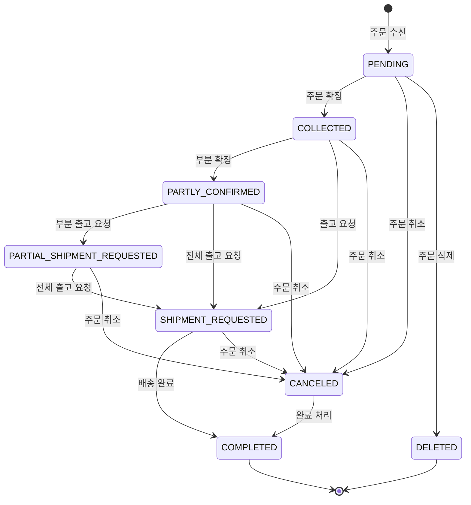

# 상태값 / 코드표

## 주문 상태 코드표

| 상태 | 코드 | 설명 | 가능한 작업 |
|------|------|------|-----------|
| 대기 | PENDING | 주문 수신, 확정 전 | 확정, 취소, 삭제, 수령인 변경 |
| 확정 | COLLECTED | 주문 확정, 재고 할당 진행 | 출고 요청, 취소, 수령인 변경 |
| 부분 확정 | PARTLY_CONFIRMED | 일부 상품만 재고 할당 | 부분 출고, 전체 출고, 취소, 수령인 변경 |
| 부분 출고 요청 | PARTIAL_SHIPMENT_REQUESTED | 일부 상품만 출고 요청 | 전체 출고 요청, 취소 |
| 출고 요청 | SHIPMENT_REQUESTED | 전체 상품 출고 요청 | 완료, 취소 |
| 취소 | CANCELED | 주문 취소됨 | 완료 처리 |
| 완료 | COMPLETED | 주문 최종 완료 | - |
| 삭제 | DELETED | 주문 삭제 (PENDING에서만) | - |

### 상태 그룹

| 그룹 | 포함 상태 | 설명 |
|------|-----------|------|
| 대기 | PENDING | 아직 확정되지 않은 주문 |
| 진행 중 | COLLECTED, PARTLY_CONFIRMED, PARTIAL_SHIPMENT_REQUESTED, SHIPMENT_REQUESTED | 처리가 진행 중인 주문 |
| 출고 진행 중 | PARTIAL_SHIPMENT_REQUESTED, SHIPMENT_REQUESTED | 출고 단계에 있는 주문 |
| 최종 완료 | COMPLETED, DELETED, CANCELED | 더 이상 상태 전이가 불가능한 주문 |

---

## 출고 상태 코드표

| 상태 | 코드 | 설명 | 가능한 전이 |
|------|------|------|-----------|
| 피킹 요청 | PICKING_REQUESTED | WMS에 상품 피킹 요청 | PICKED, PACKED, SHIPPED, DELIVERED, PICKING_REJECTED, CANCELED |
| 피킹 완료 | PICKED | 상품이 선반에서 꺼내짐 | PACKED, SHIPPED, DELIVERED, PICKING_REJECTED, CANCELED |
| 포장 완료 | PACKED | 상품 포장 완료 | SHIPPED, DELIVERED, PICKING_REJECTED, CANCELED |
| 배송 중 | SHIPPED | 배송업체에 인도됨 | DELIVERED, LOST |
| 배송 완료 | DELIVERED | 고객에게 전달 완료 (최종) | - |
| 피킹 거절 | PICKING_REJECTED | 재고 부족 등으로 피킹 불가 (최종) | - |
| 취소 | CANCELED | 출고 취소 (최종) | - |
| 분실 | LOST | 배송 중 분실 (최종) | - |

> **참고**: 일부 물류 센터에서는 피킹과 포장을 한 번에 처리하기 때문에 PICKED 단계를 건너뛸 수 있습니다.

---

## 반품 상태 코드표

| 상태 | 코드 | 설명 | 가능한 작업 |
|------|------|------|-----------|
| 대기 | PENDING | 반품 생성, 수거 전 | 수거 요청, 취소, 수령인 변경 |
| 수거 요청 | PICKUP_REQUESTED | 배송사에 수거 요청 | 취소, 검수 완료 |
| 수거 진행 | PICKUP_ONGOING | 수거 진행 중 | 취소, 검수 완료 |
| 수령 완료 | RECEIVED | 반품 센터에 도착 | 취소, 검수 완료, 강제 완료 |
| 환불 완료 | REFUNDED | 환불 처리 완료 (최종) | - |
| 취소 | CANCELED | 반품 취소 (최종) | - |

---

## 교환 상태 코드표

| 상태 | 코드 | 설명 | 가능한 작업 |
|------|------|------|-----------|
| 대기 | PENDING | 교환 생성, 수거 전 | 취소, 배송 수령인 변경 |
| 수거 요청 | PICKUP_REQUESTED | 반품 수거 요청 | 취소, 배송 수령인 변경, 검수 완료 |
| 수거 진행 | PICKUP_ONGOING | 반품 수거 중 | 취소, 배송 수령인 변경, 검수 완료 |
| 수령 완료 | RECEIVED | 반품 상품 도착 | 취소, 검수 완료, 강제 완료 |
| 검수 완료 | INSPECTED | 반품 검수 완료 | 교환 출고 요청 |
| 출고 요청 | SHIPMENT_REQUESTED | 교환 상품 출고 | - (배송 진행 대기) |
| 교환 완료 | EXCHANGED | 교환 상품 배송 완료 (최종) | - |
| 취소 | CANCELED | 교환 취소 (최종) | - |

---

## 클레임 유형 코드표

| 유형 | 코드 | 설명 | 생성되는 도메인 |
|------|------|------|---------------|
| 취소 | CANCEL | 주문/상품 취소 | - (주문에서 직접 처리) |
| 반품 | RETURN | 상품 반환 → 환불 | Return |
| 반품 강제환불 | RETURN_FORCE_REFUND | 특수 반품 → 즉시 환불 | Return |
| 교환 | EXCHANGE | 상품 반환 → 교환 출고 | Exchange |
| 재출고 | RESHIPMENT | 출고 실패 → 재배송 | Reshipment |

---

## 검수 등급 코드표

| 등급 | 코드 | 의미 | 검수 입력 가능 여부 |
|------|------|------|------------------|
| A | A | 최상 상태 | 가능 |
| B | B | 양호 상태 | 가능 |
| C | C | 기본 상태 | 가능 |
| 미검수 | NONE | 초기 상태 | 입력 불가 (시스템 기본값) |
| 취소 | CANCEL | 강제 완료 시 부여 | 입력 불가 (시스템 자동) |

---

## 주문 유형 / 수령 방법 / 태그 코드표

### 주문 유형

| 유형 | 코드 | 설명 |
|------|------|------|
| 일반 | NORMAL | 기본 주문 (기본값) |
| 선물 | GIFT | 선물 주문 |
| 처방 | RX | 처방 관련 특수 주문 |

### 수령 방법

| 방법 | 코드 | 설명 |
|------|------|------|
| 배송 | ADDRESS_DELIVERY | 주소로 배송 (기본값) |
| 매장 픽업 | STORE_PICKUP | 매장에서 직접 수령 |

### 주문 태그

| 태그 | 코드 | 설명 |
|------|------|------|
| 사전주문 | PREORDER | 사전 주문으로 표시 |

---

## 배송사 / 법인 코드표

### 배송사

| 배송사 | 코드 | 추적 가능 |
|--------|------|----------|
| CJ대한통운 | CJ | 가능 |
| DHL | DHL | 가능 |
| FedEx | FEDEX | 가능 |
| UPS | UPS | 가능 |
| 기타 | ETC | 불가 |

### 법인

| 법인 | 코드 | WMS 연동 | 검수 방식 |
|------|------|---------|----------|
| 한국 | KR | 연동 | WMS 자동 |
| 일본 | JP | 연동 | WMS 자동 |
| 미국 | US | 연동 | WMS 자동 |
| 캐나다 | CA | 미연동 | 수동 (API) |
| 대만 | TW | 미연동 | 수동 (API) |
| 싱가포르 | SG | 미연동 | 수동 (API) |
| 호주 | AU | 미연동 | 수동 (API) |

---

## 재고 이벤트 코드표

| 이벤트 | 코드 | 설명 |
|--------|------|------|
| 온라인 재고 갱신 | UPDATE_ONLINE_STOCK | ERP에서 재고 동기화 |
| 선주문 갱신 | UPDATE_PREORDER | 선주문 수량 변경 |
| 재고 이전 | TRANSFER | 채널 간 재고 이동 |
| 주문 생성 | CREATE_ORDER | 주문으로 재고 차감 |
| 주문 취소 | CANCEL_ORDER | 취소로 재고 복원 |
| 주문 출고 | SHIP_ORDER | 출고로 재고 확정 |
