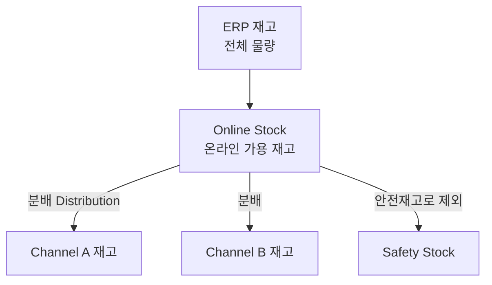

# 재고 개요와 조회 (Stock Overview)

좌측 메뉴 **Stock → Overview**에서 SKU별 재고 현황을 조회하고, **안전재고**와 **채널 노출(ON/OFF)**을 관리합니다. 먼저 재고가 어떻게 구성되는지 개념을 이해하면 화면의 숫자가 쉽게 읽힙니다.

---

## 재고 구조 이해하기

OMS 재고는 두 단계로 나뉩니다.

- **Online Stock(온라인 재고)**: 브랜드·법인 단위의 전체 가용 재고. 채널에 분배되기 전 상태.
- **Channel Stock(채널 재고)**: 각 판매 채널에 배정된 재고. 실제 판매는 이 재고에서 차감됩니다.
- **Safety Stock(안전재고)**: 품절을 막기 위해 빼두는 최소 수량. 분배·판매에서 제외됩니다.

### 가용 재고(Available) 계산

화면의 **Available**(판매 가능 수량)은 다음으로 계산됩니다.

> **Available = (Distributed + Pre-order) − (Used + Shipped)**

| 항목 | 의미 |
|------|------|
| **Distributed** | 채널에 분배된 수량 |
| **Pre-order** | 사전주문 수량 |
| **Used** | 주문이 잡혀 사용 중인 수량 (Pending~Packed 단계) |
| **Shipped** | 출고/배송 완료된 수량 |

:::warning
Available가 **음수(빨간색)**로 보이면 **초과 판매(Overselling)** 상태입니다. 즉시 재고를 확인하고 조정해야 합니다.
:::

---

## 재고 조회

상단 검색 폼에서 조건을 지정합니다.

| 필터 | 설명 |
|------|------|
| **Channel** | 채널 복수 선택 |
| **Product Type** | Single(단품) / Bundle(번들) |
| **Safety Stock Filter** | 안전재고 기준 (전체 / 1개 이상 / 0개) |
| **Pre-order Stock Filter** | 프리오더 기준 (전체 / 1개 이상 / 0개) |
| **Channel Send Status** | 채널 노출 상태 (ON / OFF) |
| 검색어 | SAP Code / SKU Code / SAP Name 중 선택해 검색 |

### 목록에서 확인하는 주요 항목

목록은 **Online Qty(온라인 재고)**, **Channel Qty(채널 재고)**, **Stock Status**, **Channel Send** 그룹으로 묶여 표시됩니다.

| 항목 | 의미 |
|------|------|
| ERP / ERP Update | ERP 기준 수량 / 일배치 이후 변동 반영분 |
| Safety | 안전재고 |
| Undistributed | 미분배 수량 |
| Distribution Ratio | 채널 분배 비율(%) |
| Distributed / Pre-order / Used / Shipped / Available | 채널 재고 세부 |
| **Stock Status** | `IN_STOCK`(재고 있음) / `OUT_OF_STOCK`(품절) / `OVERSELLING`(초과판매, 빨강) |
| **Channel Send Status** | `ON`(노출) / `OFF`(미노출) |

:::tip
각 숫자 항목에 마우스를 올리면 계산 기준 설명(툴팁)이 나타납니다. 예: Used = "Pending~Packed 사이에서 사용 중인 할당 재고".
:::

---

## 안전재고 변경 (Safety Stock)

품절 방지 버퍼를 조정하는 작업입니다.

<video controls width="100%" style={{maxWidth: '900px', borderRadius: '8px'}}>
  <source src="/oms_manual/video/iic_oms_safety.mov" />
  브라우저가 영상을 지원하지 않습니다.
</video>

1. 안전재고를 바꿀 SKU를 선택하고 **Safety** 항목의 편집(Edit)을 엽니다.
2. **Change Safety Stock** 모달에서 안전재고 수량(0 이상)을 입력합니다.
3. **"Save"**로 저장합니다.

:::note
안전재고를 높이면 그만큼 판매 가능 수량(Available)이 줄어듭니다. 인기 상품의 품절·초과판매를 막는 데 사용하세요.
:::

---

## 채널 노출 ON/OFF 와 프리오더

| 작업 | 방법 |
|------|------|
| **Channel Send ON/OFF** | Status 칸에서 채널 노출을 켜고 끕니다. OFF면 해당 채널에서 판매 중단 |
| **Off Period(중단 기간)** | 특정 기간만 노출을 끄도록 시작/종료 시각을 예약 설정 |
| **Pre-order Expired At** | 프리오더 만료일 설정. 만료일이 없으면 "Indefinite"(무기한)로 표시 |

:::note 채널별 재고 분배 비율을 바꾸려면
분배 비율(Distribution Ratio) 자체를 조정하려면 [채널 분배 설정](./distribution-setting)에서 합니다.
:::
