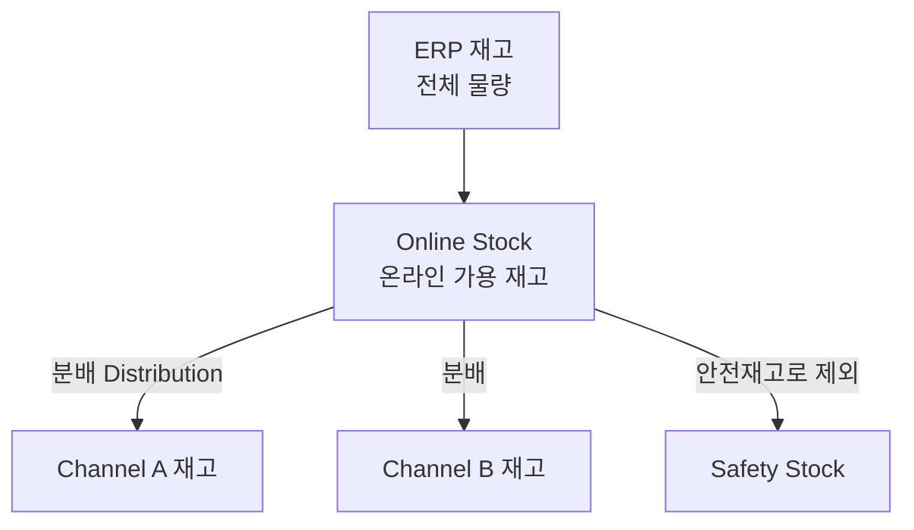

# 재고 개요와 조회 (Stock Overview)

좌측 메뉴 **Stock → Overview**에서 SKU별 재고 현황을 조회하고, **안전재고**와 **채널 노출(ON/OFF)**을 관리합니다. 먼저 재고가 어떻게 구성되는지 개념을 이해하면 화면의 숫자가 쉽게 읽힙니다.

---

## 재고 구조 이해하기

OMS 재고는 두 단계로 나뉩니다.

```mermaid
graph TD
    E[ERP 재고<br/>전체 물량] --> O[Online Stock<br/>온라인 가용 재고]
    O -->|분배 Distribution| C1[Channel A 재고]
    O -->|분배| C2[Channel B 재고]
    O -->|안전재고로 제외| S[Safety Stock]
```

- **Online Stock(온라인 재고)**: 브랜드·법인 단위의 전체 가용 재고. 채널에 분배되기 전 상태.
- **Channel Stock(채널 재고)**: 각 판매 채널에 배정된 재고. 실제 판매는 이 재고에서 차감됩니다.
- **Safety Stock(안전재고)**: 품절을 막기 위해 빼두는 최소 수량. 분배·판매에서 제외됩니다.

### 가용 재고(Available) 계산

화면의 **Available**(판매 가능 수량)은 다음으로 계산됩니다.

> **Available = (Distributed + Pre-order) − (Used + Shipped)**

| 항목 | 의미 |
|------|------|
| **Distributed** | 채널에 분배된 수량 |
| **Pre-order** | 사전주문 수량 |
| **Used** | 주문이 잡혀 사용 중인 수량 (Pending~Packed 단계) |
| **Shipped** | 출고/배송 완료된 수량 |

:::warning
Available가 **음수(빨간색)**로 보이면 **초과 판매(Overselling)** 상태입니다. 즉시 재고를 확인하고 조정해야 합니다.
:::

---

## 재고 조회

상단 검색 폼에서 조건을 지정합니다.

| 필터 | 설명 |
|------|------|
| **Channel** | 채널 복수 선택 |
| **Product Type** | Single(단품) / Bundle(번들) |
| **Safety Stock Filter** | 안전재고 기준 (전체 / 1개 이상 / 0개) |
| **Pre-order Stock Filter** | 프리오더 기준 (전체 / 1개 이상 / 0개) |
| **Channel Send Status** | 채널 노출 상태 (ON / OFF) |
| 검색어 | SAP Code / SKU Code / SAP Name 중 선택해 검색 |

### 목록에서 확인하는 주요 항목

목록은 **Online Qty(온라인 재고)**, **Channel Qty(채널 재고)**, **Stock Status**, **Channel Send** 그룹으로 묶여 표시됩니다.

| 항목 | 의미 |
|------|------|
| ERP / ERP Update | ERP 기준 수량 / 일배치 이후 변동 반영분 |
| Safety | 안전재고 |
| Undistributed | 미분배 수량 |
| Distribution Ratio | 채널 분배 비율(%) |
| Distributed / Pre-order / Used / Shipped / Available | 채널 재고 세부 |
| **Stock Status** | `IN_STOCK`(재고 있음) / `OUT_OF_STOCK`(품절) / `OVERSELLING`(초과판매, 빨강) |
| **Channel Send Status** | `ON`(노출) / `OFF`(미노출) |

:::tip
각 숫자 항목에 마우스를 올리면 계산 기준 설명(툴팁)이 나타납니다. 예: Used = "Pending~Packed 사이에서 사용 중인 할당 재고".
:::

---

## 안전재고 변경 (Safety Stock)

품절 방지 버퍼를 조정하는 작업입니다.

<video controls width="100%" style={{maxWidth: '900px', borderRadius: '8px'}}>
  <source src="/oms_manual/video/iic_oms_safety.mov" />
  브라우저가 영상을 지원하지 않습니다.
</video>

1. 안전재고를 바꿀 SKU를 선택하고 **Safety** 항목의 편집(Edit)을 엽니다.
2. **Change Safety Stock** 모달에서 안전재고 수량(0 이상)을 입력합니다.
3. **"Save"**로 저장합니다.

:::note
안전재고를 높이면 그만큼 판매 가능 수량(Available)이 줄어듭니다. 인기 상품의 품절·초과판매를 막는 데 사용하세요.
:::

---

## 채널 노출 ON/OFF 와 프리오더

| 작업 | 방법 |
|------|------|
| **Channel Send ON/OFF** | Status 칸에서 채널 노출을 켜고 끕니다. OFF면 해당 채널에서 판매 중단 |
| **Off Period(중단 기간)** | 특정 기간만 노출을 끄도록 시작/종료 시각을 예약 설정 |
| **Pre-order Expired At** | 프리오더 만료일 설정. 만료일이 없으면 "Indefinite"(무기한)로 표시 |

:::note 채널별 재고 분배 비율을 바꾸려면
분배 비율(Distribution Ratio) 자체를 조정하려면 [채널 분배 설정](./distribution-setting)에서 합니다.
:::

---

## Stock Transfer

### 1. 기능 개요

Stock Transfer는 **미분배 재고(Undistributed Qty)** 와 **채널 판매가능 재고(Available Qty)** 사이에서 재고를 옮기는 기능입니다.

| 이동 방향 | 의미 |
| --- | --- |
| `Undistributed → Available` | 아직 채널에 분배되지 않은 재고를 특정 채널의 판매가능 재고로 내려줌 (재고 추가 투입) |
| `Available → Undistributed` | 채널의 판매가능 재고를 회수해서 미분배 재고로 되돌림 (재고 회수) |

핵심 개념 2가지만 기억하면 됩니다.

- **Undistributed Qty는 SKU 단위 공용 재고입니다.** 같은 SKU를 여러 채널 행으로 선택하면 하나의 풀(pool)에서 나눠 쓰게 됩니다.
- **Available Qty는 채널 단위 재고입니다.** 회수할 때는 해당 채널이 가진 수량까지만 뺄 수 있습니다.

> ⚠️ 저장(Save) 시 **즉시** 채널로 재고가 반영됩니다. 별도의 승인/예약 절차가 없습니다.

---

### 2. 사전 조건

| 조건 | 내용 |
| --- | --- |
| 조회 필요 | 검색 필터에서 **Search**를 실행해 결과 그리드가 표시된 상태여야 버튼이 보입니다 |
| Product Type | 선택한 항목이 **모두 `Single`** 이어야 합니다. `Bundle`이 하나라도 섞이면 진행 불가 |
| 선택 단위 | 상품 행이 아닌 **채널 행 단위 체크박스**로 선택합니다 |
| Channel Send Status | `OFF` 채널도 Stock Transfer는 **제한되지 않습니다** |
| 채널 다중 선택 | 여러 채널을 동시에 선택해도 됩니다 (제한 없음) |

---

### 3. 사용 절차

#### Step 1. 대상 재고 조회

1. **Stock > Overview** 진입 → 상단 **Channel Stock Setting** 탭 클릭
2. 검색 필터에서 조건 입력
   - `Product Type`은 기본값이 **Single**입니다. Stock Transfer를 쓸 예정이면 그대로 두세요.
   - `SAP Code` / `SKU Code` / `SAP Name` 중 하나로 상품 검색
   - 필요 시 Channel, Channel Send Status, Pre-order/Safety 필터 사용
3. **Search** 클릭 → 결과 그리드 표시

#### Step 2. 채널 행 선택

- 그리드 `Channel` 영역 왼쪽의 **체크박스**로 이동 대상 채널 행을 체크합니다.
- 헤더 체크박스를 누르면 현재 페이지의 **모든 채널 행**이 한 번에 선택됩니다 (`Total` 행 제외).
- ⚠️ **검색을 다시 실행하거나 페이지를 이동하면 선택이 초기화됩니다.** 선택 → 바로 버튼 클릭 순서로 진행하세요.

#### Step 3. Stock Transfer 모달 열기

결과 그리드 오른쪽 상단의 **`Stock Transfer`** 버튼 클릭.

#### Step 4. 이동 방향(Transfer Direction) 선택

모달 상단 우측 토글에서 방향을 고릅니다. **모달 안의 모든 행에 일괄 적용**됩니다.

- `Undistributed → Available` (기본값)
- `Available → Undistributed`

> ⚠️ 방향을 바꾸면 **입력한 Move Qty가 전부 초기화**됩니다. 방향을 먼저 정하고 수량을 입력하세요.

#### Step 5. Move Qty 입력

각 행의 **Move Qty** 칸에 이동할 수량을 입력합니다.

- 숫자만 입력됩니다 (문자·기호는 자동 제거)
- 빈 값 또는 `0`인 행은 **이동 대상에서 제외**됩니다
- `Available → Undistributed` 방향에서 **이동가능한 수량은** `Transferable` 값으로 확인할 수 있습니다.
  - Transferable Qty : {Available - PreOrder} Qty
  - *프리오더로 입력한 수량은 가상의 재고이기에 이동이 불가*
- **`Max` 버튼**: 그 행에 넣을 수 있는 최대 수량이 자동 입력됩니다
  - `Undistributed → Available` 방향: `Undistributed Qty − 같은 SKU 다른 행에 이미 입력한 합계`
  - `Available → Undistributed` 방향: 해당 채널의 `Transferable Qty`
- **`Max All` 버튼**: 모든 제품의 Move Qty 필드 내 최대 수량을 일괄 입력합니다.

#### Step 6. 저장

모달 하단에서 최종 확인 후 **`Save`** 클릭.

하단 정보 영역

- `Transfer Row`: 실제로 이동될 행 수 (수량 > 0 & 오류 없음)
- `FROM ○○○ → TO ○○○` 배지: 현재 방향의 출발/도착 구분
- 정상 상태일 때 경고: `⚠ Clicking 'Save' will instantly move the stock.`
- 오류가 있을 때 경고: `⚠ Some rows exceed the remaining stock.`

`Save` 클릭 → 확인 팝업

> `The data being saved will be immediately transferred to the channel. Continue?`
> - **Continue**: 이동 실행
> - **Leave without saving**: 저장하지 않고 닫기

성공하면 스낵바가 표시되고 그리드가 자동으로 갱신됩니다.
> `Update Successful — Your changes have been successfully applied.`

#### Step 6-1. Save 버튼이 비활성화되는 경우

- 오류 행이 **1건이라도** 있을 때
- 이동 대상 행이 **0건**일 때 (모든 행이 빈 값 또는 0)
