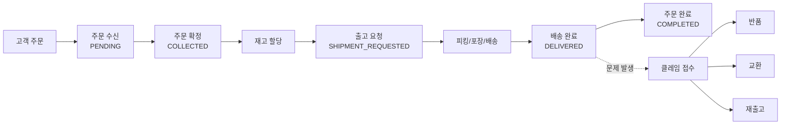

# OMS 개요

---

## OMS란?

OMS(Order Management System)는 **고객이 주문을 하는 순간부터 상품이 고객에게 도착하거나, 반품·교환이 완료될 때까지의 전체 과정**을 관리하는 시스템입니다.

## OMS가 관리하는 것들

| 도메인 | 설명 |
|--------|------|
| 주문(Order) | 고객이 상품을 구매한 건 |
| 출고(Shipment) | 상품을 포장해서 배송하는 건 |
| 매장픽업(Store Pickup) | 고객이 매장에서 직접 수령하는 건 |
| 반품(Return) | 상품을 돌려받고 환불하는 건 |
| 교환(Exchange) | 상품을 돌려받고 다른 상품을 보내는 건 |
| 클레임(Claim) | 반품/교환/취소 요청을 묶어 관리하는 건 |
| 재출고(Reshipment) | 출고가 실패한 건을 다시 보내는 건 |
| 재고(Stock) | 채널별 판매 가능한 수량을 관리하는 것 |

## 전체 흐름 한눈에 보기

---

## 계정 및 권한

### 채널 기반 접근 제어

> **중요**: 사용자는 자신에게 할당된 채널의 데이터만 조회·관리할 수 있습니다.

예를 들어, ATiissu 담당자는 ATiissu Official 채널의 주문만 볼 수 있고, Nuflaat 채널의 주문은 보이지 않습니다.

채널 접근이 필요할 경우 '권한 요청' 이 필요합니다.

---

## 튜토리얼 준비물

### 필요한 샘플 데이터

튜토리얼을 따라하려면 아래 항목이 준비되어야 합니다:

1. **OMS 계정**: MANAGER 이상 역할의 계정
2. **접근 가능한 채널**: 최소 1개 채널에 대한 접근 권한
3. **테스트 주문**: 판매 채널에서 테스트 주문 1건 생성
4. **재고 확인**: 해당 채널에 테스트 상품의 가용 재고가 존재하는지 확인

### 환경 접속
- **관리자 화면(BO)**: Back Office 웹 애플리케이션에 로그인
- 인증: JWT 토큰 기반 (로그인 후 자동 발급)
