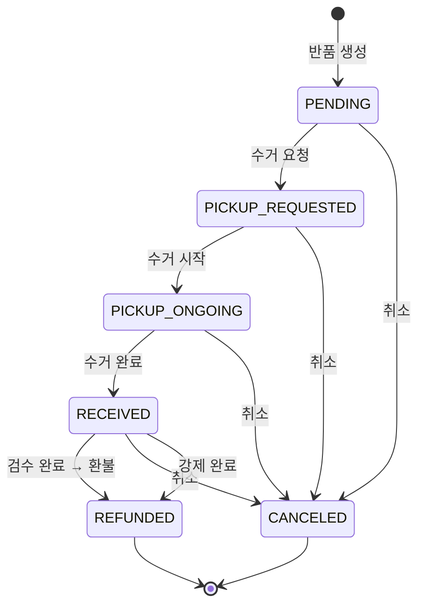
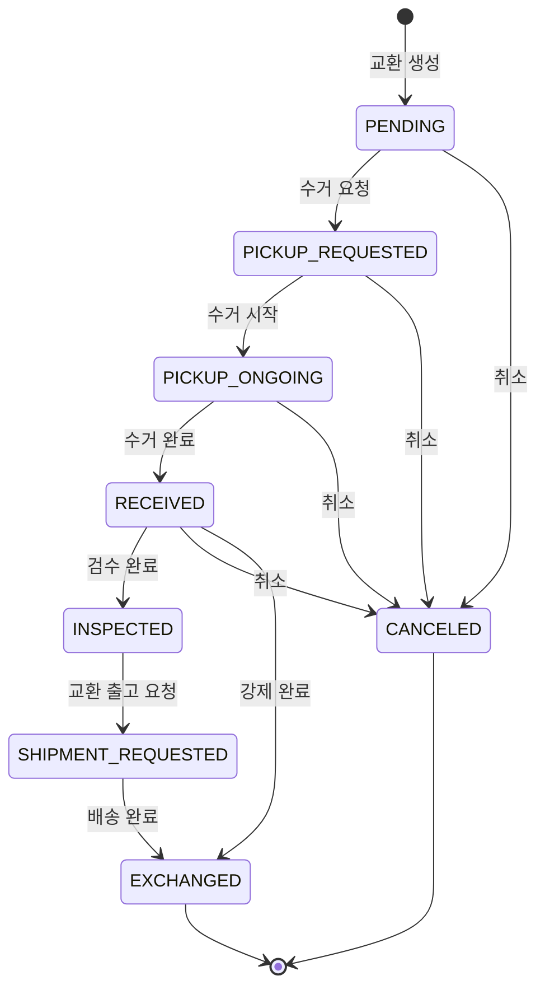

# 클레임 1건 처리

## 시나리오 A: 반품 (기본)

고객이 상품을 받은 후 반품을 요청하는 상황입니다.

### Step 1. 클레임 접수

1. 해당 주문의 상세 화면으로 이동
2. **클레임 등록** 버튼 클릭
3. 클레임 유형: **반품(RETURN)** 선택
4. 사유 입력 (예: "사이즈 불일치")
5. 책임 구분 선택:
   - **고객 책임(CUSTOMER)**: 단순 변심, 사이즈 불일치 등
   - **운영 책임(OPERATION)**: 상품 불량, 오배송 등
6. 반품 상품 및 수량 선택
7. 등록 완료

### Step 2. 반품 수거

클레임이 등록되면 반품(Return)이 생성됩니다.

```
반품 생성(PENDING) → 수거 요청(PICKUP_REQUESTED) → 수거 진행(PICKUP_ONGOING) → 수령 완료(RECEIVED)
```

- **수거 요청**: 배송업체에 반품 상품 픽업 요청
- **수거 진행**: 배송업체가 고객 주소로 방문하여 수거 중
- **수령 완료**: 반품 센터에 상품 도착

> **수거 전 취소**: `대기(PENDING)` 상태에서는 고객이 반품을 취소할 수 있습니다.

### Step 3. 반품 검수

상품이 반품 센터에 도착하면 검수를 진행합니다.

**검수 등급**:

| 등급 | 의미 |
|------|------|
| **A** | 최상 상태 — 재판매 가능 |
| **B** | 양호 — 약간의 사용 흔적, 재판매 가능 |
| **C** | 기본 — 눈에 띄는 사용 흔적, 재판매 가능 |

1. 반품 상세 화면에서 **검수 완료** 클릭
2. 각 상품별로 검수 등급(A/B/C)과 수량 입력
3. 모든 상품이 검수되어야 완료 가능
4. 검수 완료 → 환불 처리(REFUNDED) → 반품 완료

> **주의**: 검수 시 모든 상품의 등급과 수량을 빠짐없이 입력해야 합니다. 누락된 상품이 있으면 오류가 발생합니다.

> **강제 완료**: `수령 완료(RECEIVED)` 상태에서 검수를 건너뛰고 강제로 완료할 수 있습니다. 이 경우 미검수 상품은 자동으로 `취소(CANCEL)` 등급으로 처리됩니다.

> **변경사항 (OMS-2026)**: 반품과 교환의 검수 완료 로직이 통합되었습니다. Kafka Consumer와 API가 동일한 메서드를 사용하도록 개선되어 일관된 처리가 보장됩니다.

> **자가물류 법인 지원 (OMS-1901)**: WMS를 사용하지 않는 법인(CA, AU, TW, SG)에서는 수동으로 검수 완료를 호출할 수 있습니다. WMS를 사용하는 법인(KR, JP, US)에서는 WMS에서 자동으로 검수 결과가 전달됩니다.

### 반품 전체 흐름



---

## 시나리오 B: 교환 (확장)

고객이 받은 상품을 다른 상품으로 교환하는 상황입니다.

### Step 1. 클레임 접수 (교환)

1. 주문 상세에서 **클레임 등록**
2. 유형: **교환(EXCHANGE)** 선택
3. 사유, 책임 구분, 교환 상품 선택
4. 등록 완료

### Step 2. 반품 수거 (교환의 첫 번째 단계)

교환도 먼저 기존 상품을 돌려받아야 합니다. 반품과 동일한 수거 프로세스:

```
교환 생성(PENDING) → 수거 요청 → 수거 진행 → 수령 완료(RECEIVED)
```

### Step 3. 검수 완료

반품 센터에서 상품 검수 후 등급을 부여합니다.

- 검수 완료 시 → `검수 완료(INSPECTED)` 상태로 전환
- 반품과의 차이: 반품은 검수 후 바로 환불, 교환은 검수 후 **새 상품 출고** 단계로 이동

### Step 4. 교환 상품 출고

검수가 완료되면 교환할 새 상품을 출고합니다.

1. **출고 요청** → 교환 출고(ExchangeShipment) 생성
2. 출고 상태는 일반 출고와 동일:
   ```
   피킹 요청 → 피킹 완료 → 포장 완료 → 배송 중 → 배송 완료
   ```
3. 배송 완료 → 교환 완료(EXCHANGED)

> **교환 배송 수령인 변경**: 출고 요청 전까지(`PENDING`, `PICKUP_REQUESTED`, `PICKUP_ONGOING` 상태) 교환 상품의 배송 주소를 변경할 수 있습니다.

> **교환 출고 관리 기능 (OMS-1997)**: 교환 출고에 대한 취소 요청, 분실 처리, 거절 관련 기능이 추가되었습니다.

### 교환 전체 흐름



---

## 반품 vs 교환 비교

| 구분 | 반품 | 교환 |
|------|------|------|
| 목적 | 환불 | 다른 상품 제공 |
| 수거 과정 | 동일 | 동일 |
| 검수 후 | 바로 환불(REFUNDED) | 새 상품 출고 단계로 이동(INSPECTED) |
| 배송 관리 | 없음 | ExchangeShipment으로 별도 관리 |
| 최종 상태 | REFUNDED | EXCHANGED |
| 추가 작업 | 없음 | 출고 취소, 재출고, 분실 처리 가능 |
