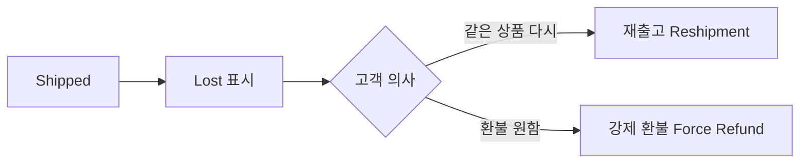

# 배송 분실 (Delivery Lost)

> **상황**: 출고된(Shipped) 상품이 배송 중 분실되어 고객에게 도착하지 않았습니다.

## 대응 순서

1. **출고 상태 확인** — 분실 처리는 출고 상태가 **Shipped**일 때만 가능합니다.
2. **Lost로 표시** — 주문 상세에서 해당 출고를 분실로 처리합니다. ([출고와 배송 추적 — 분실 처리](../order/shipment#분실lost-처리))
3. **후속 처리 선택**
   - **재출고(Reshipment)**: 같은 상품을 다시 발송. 고객 추가 부담 없음 → [재출고 처리](../order/reshipment)
   - **강제 환불(Force Refund)**: 재발송 없이 즉시 환불

## 체크 포인트

- 분실은 **운영 귀책(OPERATION)**으로 처리되는 것이 일반적입니다.
- 재고가 없으면 재출고가 불가능하므로, 재고를 먼저 확인하고 없으면 강제 환불을 안내하세요.
