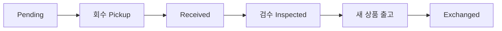

# 교환 시나리오 (Exchange Scenarios)

> **상황**: 고객이 사이즈/색상이 안 맞거나 하자로 교환을 요청했습니다.

교환은 **기존 상품 회수 → 검수 → 새 상품 발송**의 순서로 진행됩니다. 자세한 화면 조작은 [교환 처리](../order/exchange)를 참고하세요.

## 일반 교환 (사이즈/색상 변경)

1. 회수 요청 → 기존 상품 입고(**Received**)
2. **Refund Grading**으로 검수(A/B/C) → **Inspected**
3. **Request Shipment**로 새 상품 발송 → **Exchanged**

## 하자 교환 (운영 귀책)

- 귀책을 **OPERATION**으로 처리합니다.
- 회수 상품이 명백한 하자(C등급)라도 교환 진행이 가능합니다.

## 교환을 취소해야 할 때

- 검수 시작 전(**Pending / Pickup Requested / Pickup Ongoing / Received**)에는 **"Cancel Exchange"**로 취소 가능.
- **Inspected** 이후에는 취소할 수 없습니다. 이 경우 새 상품 발송을 진행하거나, 별도 반품/환불로 정리합니다.

## 새 상품 재고가 없을 때

교환할 새 상품의 재고가 없으면 출고 요청 시 피킹이 거부될 수 있습니다. 재고를 확보하거나, 고객과 협의해 환불(반품)으로 전환하세요.
