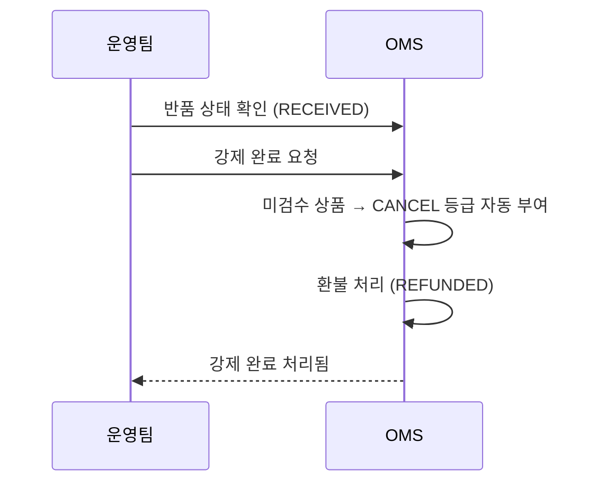

# 부분 검수 후 환불 시나리오

## 상황
반품 상품 3개 중 2개만 검수를 진행하고, 나머지 1개는 처리가 어려운 경우.

## 처리 방법

### 방법 1: 전체 검수 완료 후 환불

모든 반품 상품에 대해 등급을 부여한 뒤 환불합니다.

1. 반품 상세 → **검수 완료** 클릭
2. 상품별 등급 입력:
   - 상품 A: 등급 `A` (최상 상태)
   - 상품 B: 등급 `B` (양호)
   - 상품 C: 등급 `C` (기본)
3. 모든 상품 검수 완료 → 환불 진행(`REFUNDED`)

> **주의**: 검수 수량이 반품 수량과 정확히 일치해야 합니다. 누락된 상품이 있으면 `All items must be inspected` 오류가 발생합니다.

### 방법 2: 강제 완료 (일부 상품 검수 불가 시)

검수할 수 없는 상품이 있는 경우 강제 완료를 사용합니다.

1. 반품 상태가 `수령 완료(RECEIVED)`인지 확인
2. **강제 완료** 클릭
3. 미검수 상품은 자동으로 `CANCEL` 등급 처리
4. 환불은 정상 진행

> **강제 완료는 `수령 완료(RECEIVED)` 상태에서만 가능합니다.** 다른 상태에서는 강제 완료 버튼이 비활성화됩니다.

## 검수 등급별 의미

| 등급 | 의미 | 입력 방법 |
|------|------|----------|
| A | 최상 상태 — 재판매 가능 | 운영자 수동 입력 |
| B | 양호 — 약간의 사용 흔적 | 운영자 수동 입력 |
| C | 기본 — 눈에 띄는 사용 흔적 | 운영자 수동 입력 |
| NONE | 미검수 (초기 상태) | 시스템 기본값 |
| CANCEL | 검수 취소 (강제 완료 시) | 시스템 자동 부여 |

## 교환 건의 부분 검수

교환 건도 동일한 검수 프로세스를 따릅니다.

- 교환 상태가 `RECEIVED`일 때 검수 완료 가능
- 모든 상품 검수 후 → `INSPECTED` 상태로 전환 → 교환 출고 요청 가능
- 강제 완료 시 → 미검수 상품은 `CANCEL` 등급, 교환 완료(`EXCHANGED`)

## 핵심 포인트

- 검수는 **모든 상품에 대해** 진행해야 함 (일부만 검수하고 완료 불가)
- 검수가 어려운 상품이 있으면 **강제 완료**로 처리
- 강제 완료된 상품(`CANCEL` 등급)도 환불 대상에 포함됨
- WMS 연동 법인에서는 검수 결과가 자동 전달되므로 수동 검수 불가
