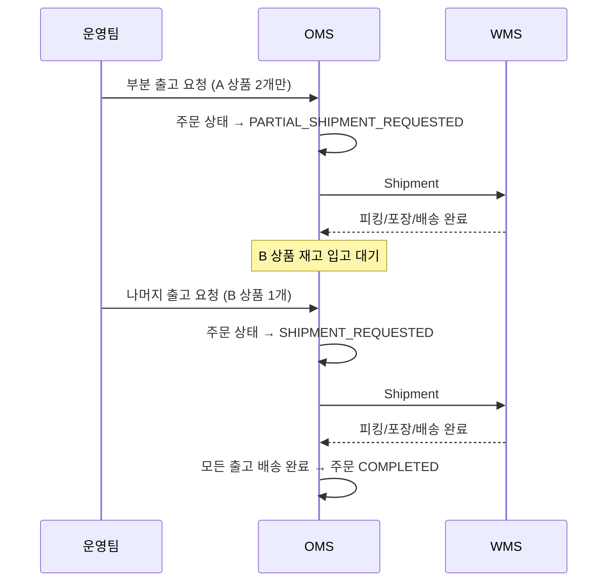

# 부분출고 / 분할배송 시나리오

## 상황
고객이 A 상품 2개, B 상품 1개를 주문했는데, A 상품만 재고가 있는 경우.

## 처리 흐름

## 핵심 포인트
- 하나의 주문이 여러 출고(Shipment) 건으로 나뉠 수 있음
- 모든 출고 건이 `배송 완료(DELIVERED)`가 되어야 주문이 `완료(COMPLETED)`
- 부분 출고 시 남은 상품의 출고 가능 수량 자동 계산
