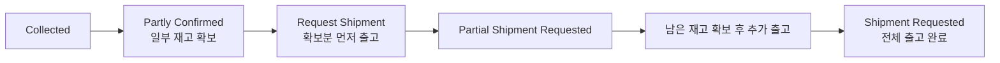

# 부분 출고/분할 배송 (Partial Shipment)

> **상황**: 주문한 여러 상품 중 일부만 재고가 확보되어, 먼저 출고하고 나머지는 나중에 보내야 합니다.

## 대응 순서

1. 주문이 **Partly Confirmed**(일부만 할당) 상태가 됩니다.
2. 주문 상세 ORDER 탭에서 **"Request Shipment"**로 확보된 상품을 먼저 출고합니다. ([부분 출고 요청](../order/order-cancel#부분-출고-요청))
3. 주문은 **Partial Shipment Requested**가 되고, 남은 상품은 재고가 확보되는 대로 추가 출고합니다.
4. 모든 상품이 출고되면 **Shipment Requested**가 됩니다.

## 체크 포인트

- **Partial Shipment Requested** 상태에서는 **미출고분만** 취소할 수 있습니다(이미 출고된 상품은 취소 불가).
- 남은 상품이 장기간 확보되지 않으면, 미출고분을 취소하고 환불 안내를 고려하세요.
