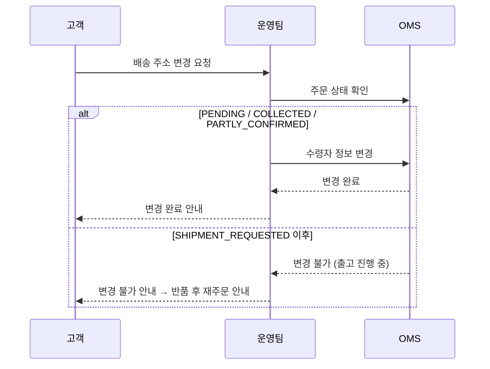

# 수령자 변경 제한 시나리오

## 상황
고객이 배송 주소 또는 수령자 정보를 변경 요청한 경우.

## 변경 가능 조건

수령자 변경은 **출고가 시작되기 전**에만 가능합니다.

| 도메인 | 변경 가능 상태 | 변경 불가 상태 |
|--------|--------------|---------------|
| 주문 수령자 | `PENDING`, `COLLECTED`, `PARTLY_CONFIRMED` | `SHIPMENT_REQUESTED` 이후 |
| 반품 수거 주소 | `PENDING` | `PICKUP_REQUESTED` 이후 |
| 교환 배송 수령자 | `PENDING`, `PICKUP_REQUESTED`, `PICKUP_ONGOING` | `RECEIVED` 이후 |

## 처리 흐름

### 주문 수령자 변경

### 반품 수거 주소 변경

- `대기(PENDING)` 상태에서만 변경 가능
- 수거 요청이 배송사에 전달된 후에는 주소 변경 시 배송사와 정보 불일치 발생

### 교환 배송 수령자 변경

- 교환 상품의 배송 주소는 `PENDING`, `PICKUP_REQUESTED`, `PICKUP_ONGOING` 상태에서 변경 가능
- 검수 완료(`RECEIVED`) 이후에는 출고 단계에 진입하므로 변경 불가

## 핵심 포인트

- 출고가 시작된 후 수령자 변경이 필요한 경우, **반품 후 재주문**으로 안내
- 배송사에 이미 전달된 정보는 OMS에서 변경할 수 없음
- 수령자 변경 시 주문 이력에 변경 기록이 자동 저장됨
