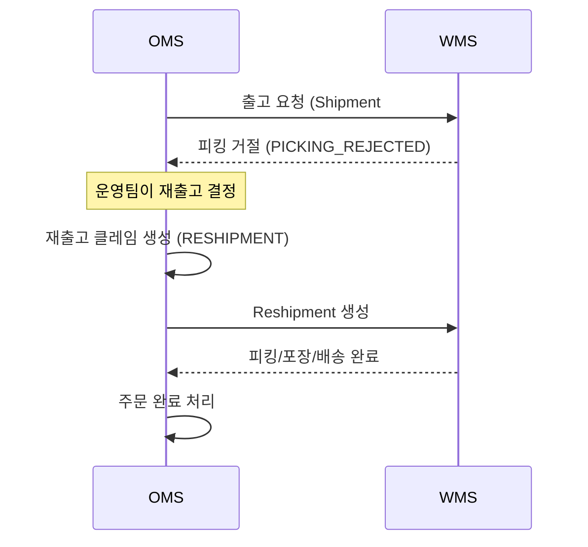

# 출고 거절 → 재출고 시나리오

## 상황
WMS에서 재고 불일치로 피킹이 거절된 경우.

## 처리 흐름

```mermaid
sequenceDiagram
    participant OMS
    participant WMS

    OMS->>WMS: 출고 요청 (Shipment #1)
    WMS-->>OMS: 피킹 거절 (PICKING_REJECTED)

    Note over OMS: 운영팀이 재출고 결정

    OMS->>OMS: 재출고 클레임 생성 (RESHIPMENT)
    OMS->>WMS: Reshipment 생성
    WMS-->>OMS: 피킹/포장/배송 완료
    OMS->>OMS: 주문 완료 처리
```

> **재출고 기능 확장 (OMS-1998)**: 재출고에 대해서도 출고 취소, 분실 처리, 거절 관련 기능이 추가되었습니다. 재출고 배송 중 분실이 발생하면 `LOST` 상태로 전이되며, 재출고 클레임을 다시 접수할 수 있습니다.
