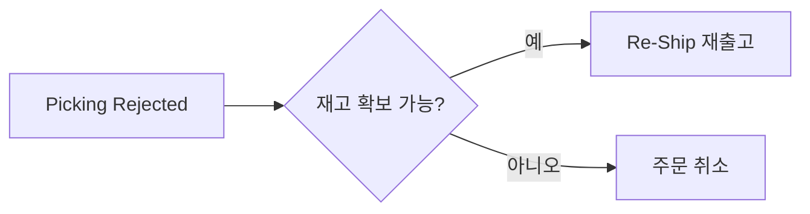

# 출고 거부와 재출고 (Picking Rejected → Reshipment)

> **상황**: 창고에서 재고 부족 등으로 피킹이 거부(Picking Rejected)되어 출고가 실패했습니다.

## 대응 순서

1. **상태 확인** — 출고 상태가 **Picking Rejected**인지 확인합니다.
2. **재고 확인** — [재고 개요](../stock/overview)에서 해당 SKU의 가용 재고(Available)를 확인합니다.
3. **처리 선택**
   - 재고가 있으면 → 주문 상세 **RESHIPMENT 탭**에서 **"Re-Ship"** ([재출고 처리](../order/reshipment))
   - 재고가 없으면 → [주문 취소](../order/order-cancel)로 마무리하고 고객에게 안내

## 체크 포인트

- 같은 SKU에서 반복적으로 피킹 거부가 발생하면, 재고 데이터 불일치일 수 있습니다. → [재고 불일치/동기화 지연](./inventory-mismatch-sync-delay)
- 안전재고(Safety Stock) 설정이 과도하면 가용 재고가 부족해 보일 수 있으니 함께 확인하세요.
