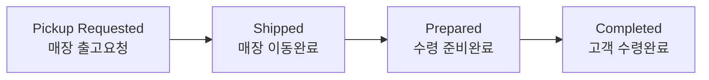

# 매장픽업 운영 (Store Pickup)

> **상황**: 고객이 매장 수령으로 주문했습니다. 창고 → 매장 → 고객 수령까지 진행 상태를 관리해야 합니다.

## 진행 흐름

1. 주문이 들어오면 창고에서 매장으로 상품을 보냅니다(**Pickup Requested**).
2. 매장에 도착하면 **Shipped → Prepared**(수령 준비)로 진행됩니다.
3. 고객이 매장에서 수령하면 **Completed**가 됩니다.

## 운영자 팁

- **Order List**에서 **Receive Methods = Store Pickup**으로 필터링하면 매장픽업 주문만 모아 볼 수 있습니다.
- 대시보드 ORDER 탭의 **Store Pickup** 영역에서 단계별 현황을 확인합니다.
- 고객이 **수령(Completed) 전**에 취소를 원하면 주문 상세에서 취소합니다(자동 환불·재고 복귀).

자세한 화면 설명은 [매장픽업](../order/store-pickup)을 참고하세요.
