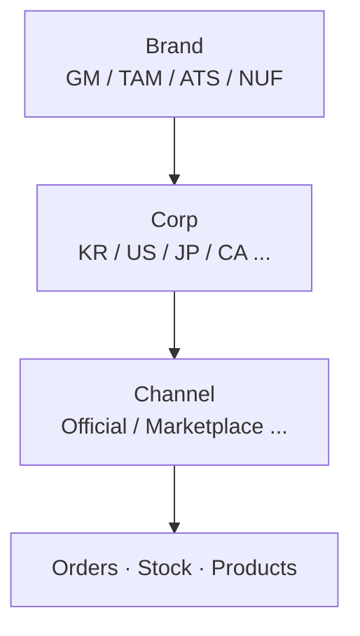
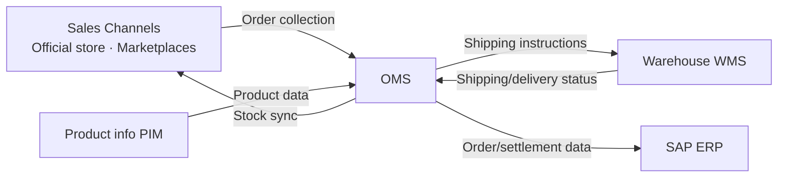

# Core Concepts Every Operator Should Know

Before you start using the OMS in earnest, understanding how the system divides and handles its data will make every feature easier. This page gives you the big picture of the **brand / corporation / channel structure**, the **permission model**, and **integrations with external systems**.

---

## Brand · Corporation · Channel Structure

All data in the OMS (orders, stock, products) is organized into the following three levels.

| Level | Meaning | Examples |
|------|------|------|
| **Brand** | The brand that sells the products | GENTLE MONSTER, TAMBURINS, ATIISSU, NUFLAAT |
| **Corp** | The national corporation where sales and settlement take place | KR (Korea), US (United States), JP (Japan), CA (Canada), TW, SG, AU |
| **Channel** | The actual outlet where sales occur | Official store, Marketplaces (KAKAO, SSG, FARFETCH, etc.) |

When you select a **Brand & Corp** in the header at the top of the screen, only the data belonging to that combination is displayed. In other words, selecting "GM (KR)" shows only orders and stock for the GENTLE MONSTER Korea corporation. (For details on how to switch, see [Screen Tour](./screen-tour).)

---

## Permission Model — The Scope of Data You Can See

:::warning Key principle
An operator can view and manage **only the data for the brand × corporation combinations assigned to them**.
:::

For example, a user who only has "GM KR" permission can see only GENTLE MONSTER Korea orders; orders for Japan (JP) or other brands are not visible. If you need additional access, you must submit a **Request Permission** and obtain approval from an administrator.

Permissions consist of two parts.

- **Access scope**: which brand × corporation combinations you can see
- **Role**: what you can do within that scope (view only / process / manage)

The types of roles and the permission request/approval process are covered in detail in the [User](../user/user-list) chapter.

---

## Integration with External Systems (What Operators Should Know)

The OMS does not operate on its own; it exchanges data with several external systems. Issues you encounter during operations such as "orders aren't coming in," "stock doesn't match," or "tracking numbers appear late" are usually caused by these integrations, so understanding the flow makes it easier to identify the root cause.

| External System | Role | What operators observe |
|-------------|------|------------------------|
| **Sales Channels** | Where orders come in | Order collection runs periodically, so it may take time for a channel order to appear in the OMS |
| **WMS (warehouse)** | Performs picking, packing, and shipping | Shipping statuses (Picking/Packed/Shipped) are passed from the warehouse to the OMS |
| **SAP (ERP)** | Settlement and finance | Data is sent to SAP when an order is confirmed |
| **PIM** | Source of product information | The reference for product names and SKU information |

:::note
Specific responses to problems caused by integration delays (orders not received, stock mismatches, etc.) are covered in [Common Scenarios — Stock Mismatch / Sync Delay](../use-cases/inventory-mismatch-sync-delay).
:::

---

## Next steps

- [Login and Permissions](./login-and-roles) — How to log in and request permissions
- [Screen Tour](./screen-tour) — Get familiar with the header, menus, and common UI
- [Glossary](./glossary) — A summary of terms that appear frequently in this manual
