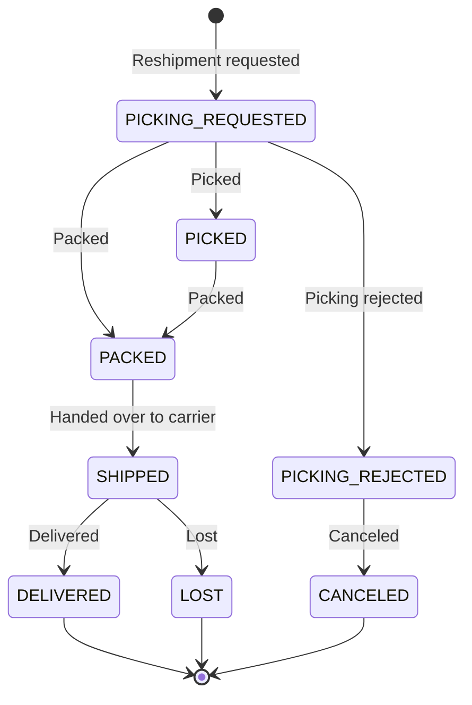

# Reshipment Management

## What Is Reshipment?

Reshipment is the process of shipping the same product again when a shipment fails or is lost during delivery.

## When Reshipment Occurs

| Cause | Description |
|-------|-------------|
| Picking rejected | Picking is rejected by WMS due to insufficient stock, etc. |
| Delivery lost | Product is lost during delivery |
| Exchange shipment failed | Picking is rejected for an exchange shipment |

## Searching Reshipments

**Search filters:**

| Filter | Description |
|--------|-------------|
| Date Range | Based on reshipment request date |
| Channel | Sales channel |
| Status | In progress / final |

**Reshipment statuses:**

| Group | Included Statuses |
|-------|-------------------|
| In Progress | `PICKING_REQUESTED`, `PICKED`, `PACKED`, `SHIPPED` |
| Final | `DELIVERED`, `LOST`, `CANCELED` |

## Creating Reshipment

### General Order Reshipment

1. Go to order detail -> check shipment.
2. Check the shipment in `Picking Rejected (PICKING_REJECTED)` or `Lost (LOST)` status.
3. Register a **reshipment claim** (claim type: `RESHIPMENT`).
4. A Reshipment case is automatically created.
5. A new picking request is sent to WMS and delivery proceeds.

### Exchange Case Reshipment

When an ExchangeShipment is picking rejected:

1. Go to exchange detail -> check exchange shipment.
2. Confirm `Picking Rejected (PICKING_REJECTED)` status.
3. Click **Request Reshipment**.
4. A new exchange shipment is created and delivery resumes.

## Reshipment Status Flow

## Available Reshipment Actions

| Action | Available Status | Description |
|--------|------------------|-------------|
| Cancel shipment | `PICKING_REJECTED` | Cancel reshipment |
| Mark lost | `SHIPPED` | Mark reshipment as lost during delivery |
| Reship again | `LOST` | Register another claim for a lost reshipment |

> **Reshipment Feature Expansion (OMS-1997, OMS-1998)**: Shipment cancellation, loss handling, and rejection-related features were added for reshipments. If a reshipment is lost during delivery, it transitions to `LOST`, and a reshipment claim can be registered again.
