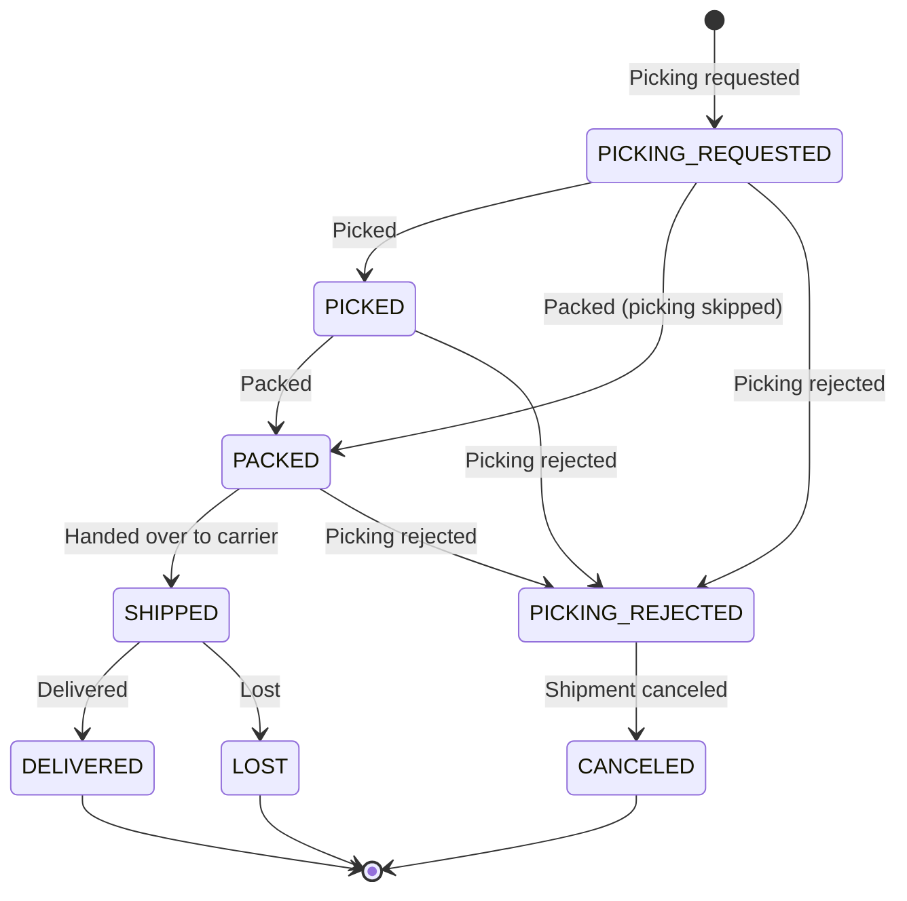

# Shipment Search / Delivery Tracking

## Searching Shipment List

You can use the shipment status filter in the order list, or search directly by shipment number.

**Search filters:**

| Filter | Description | Input Limit |
|--------|-------------|-------------|
| Shipment No. | Unique shipment number | Up to 100 |
| Shipment Status | Shipment progress status | Multiple selection available |
| Channel | Sales channel | Only within the user's permission scope |
| Date Range | Based on shipment request date | Required when searching completed cases |

## Shipment Details

You can check shipments connected to an order from the order detail screen.

**Information shown per shipment:**

| Item | Description |
|------|-------------|
| Shipment No. | OMS unique shipment number |
| WMS No. | Logistics center management number |
| Shipment Status | Current delivery progress status |
| Event | Most recent processing event |
| Recipient | Delivery recipient information |
| Carrier | CJ, DHL, FedEx, UPS, ETC |
| Tracking No. | Delivery tracking number |
| Tracking URL | Carrier tracking link |
| Shipped At | Time handed over to the carrier |
| Cancellation Reason | Reason for cancellation/rejection |

## Delivery Tracking

When shipment status is `Shipped (SHIPPED)` or later, a carrier-specific tracking URL is provided.

**Carrier tracking:**

| Carrier | Tracking Method |
|---------|-----------------|
| CJ Logistics | Track on the CJ website using the tracking number |
| DHL | DHL Express tracking |
| FedEx | FedEx tracking |
| UPS | UPS tracking |
| Other (ETC) | Tracking URL not provided |

> **Note**: You can click the tracking URL directly from the shipment detail screen.

## Checking Split Delivery

One order can have multiple shipments.

- Check all shipments in Order Detail -> **Related Shipment List**
- Product list and quantity are shown per shipment
- Track the delivery status of each shipment separately

## Shipment Status Flow

> **Note**: Some logistics centers process picking and packing together, so the `PICKED` step may be skipped.

## Available Shipment Actions

| Action | Available Status | Description |
|--------|------------------|-------------|
| Cancel shipment | `PICKING_REJECTED` | Cancel shipment for a picking-rejected case |
| Mark lost | `SHIPPED` | Record loss during delivery |
| Offline dispatch | Channel-specific setting | Process offline shipment for non-standard channels |

> **Shipment Loss Handling (OMS-1911)**: Loss handling is available for shipments in Shipped status. If reshipment is required after a loss, register a reshipment claim.
