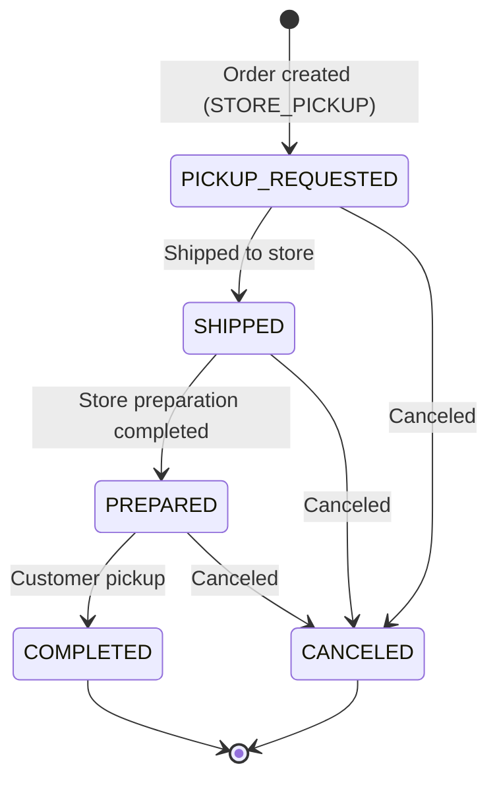

# Store Pickup Management

## What Is Store Pickup?

Store Pickup is a method where customers order online and **pick up the product directly at a store**. When the order is created, the received method is set to `STORE_PICKUP`.

## Searching Store Pickup

In the order list, set the received method filter to `Store Pickup (STORE_PICKUP)`, or use the store pickup status filter.

**Filters:**

| Filter | Description |
|--------|-------------|
| Received Method | Select `STORE_PICKUP` |
| Store Pickup Status | Filter by progress status |
| Channel | Sales channel |
| Date Range | Based on order date |

> **Store Pickup Status Filter (OMS-2022)**: You can filter store pickup orders by progress status.

> **Received Method Filter (OMS-2017)**: You can search delivery orders and store pickup orders separately.

## Store Pickup Status

| Status | Code | Description |
|--------|------|-------------|
| Pickup Requested | PICKUP_REQUESTED | Created automatically when the order is created |
| Shipped | SHIPPED | Product shipped from the logistics center to the store |
| Prepared | PREPARED | Store completed preparation for customer pickup |
| Completed | COMPLETED | Customer picked up the product at the store |
| Canceled | CANCELED | Store pickup canceled |

## Store Pickup Processing Flow

### Step 1. Check Store Pickup Request

When a customer selects `Store Pickup` as the received method during order placement, a store pickup case is created automatically.

- Check it in Order Detail -> **Related Store Pickup**
- Initial status: `Pickup Requested (PICKUP_REQUESTED)`

### Step 2. Ship Product to Store

The logistics center ships the product to the store.

- Status change: `PICKUP_REQUESTED` -> `SHIPPED`
- Processed as B2B outbound shipment

### Step 3. Store Preparation Completed

The store receives the product and completes preparation for customer handoff.

- Status change: `SHIPPED` -> `PREPARED`
- Customer is notified that pickup is available

### Step 4. Customer Pickup Completed

The customer visits the store and picks up the product.

- Status change: `PREPARED` -> `COMPLETED`
- Store pickup completed -> order completion processing

## Checking History of Store Pickup Orders

Store pickup-related events can also be checked in order history.

> **History Expansion (OMS-1996)**: Store pickup history was added to order history.

> **Store Pickup Feature (OMS-1913 ~ OMS-1917)**: Store pickup entities and event handling were newly developed.
