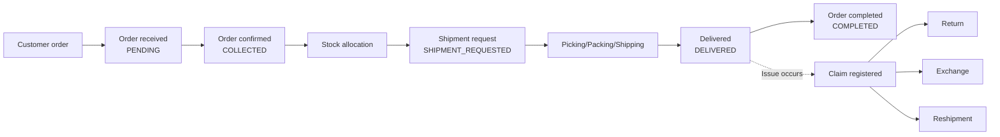

# OMS Overview

---

## What Is OMS?

OMS (Order Management System) manages the full process from the moment a customer places an order until the product reaches the customer, or until a return or exchange is completed.

## What OMS Manages

| Domain | Description |
|--------|-------------|
| Order | A purchase placed by a customer |
| Shipment | Packing and delivering products |
| Store Pickup | A customer picking up products directly at a store |
| Return | Receiving returned products and processing a refund |
| Exchange | Receiving returned products and shipping replacement products |
| Claim | A unit that manages return, exchange, cancellation, and reshipment requests |
| Reshipment | Shipping again after a shipment failed |
| Stock | Managing quantities available for sale by channel |

## Overall Flow

---

## Accounts and Permissions

### Channel-Based Access Control

> **Important**: Users can only view and manage data for channels assigned to them.

For example, an ATiissu operator can only see orders from the ATiissu Official channel. Orders from the Nuflaat channel are not visible.

If channel access is required, a permission request must be submitted.

---

## Tutorial Prerequisites

### Required Sample Data

To follow the tutorial, prepare the following:

1. **OMS account**: An account with the MANAGER role or higher
2. **Accessible channel**: Access to at least one channel
3. **Test order**: One test order created in a sales channel
4. **Stock check**: Confirm that available stock exists for the test product in that channel

### Environment Access
- **Admin screen (BO)**: Log in to the Back Office web application
- Authentication: JWT-token based; issued automatically after login
