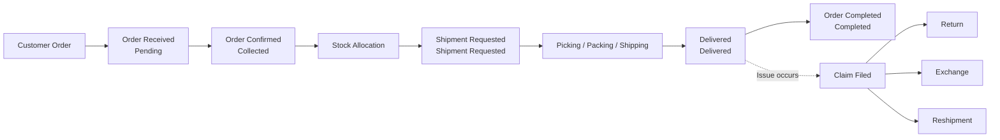

# OMS Operator Manual

This is the official user manual for IIC OMS (Order Management System) operators. The manual is organized **in the order of the screens (menus)**, so you can follow along directly while looking at the left-hand menu.

:::tip New here?
Start with the [**Getting Started**](./getting-started/overview) chapter. Once you understand how to log in, how permissions work, how the screens are laid out, and the basic terminology, every other feature becomes much easier to grasp.
:::

---

## What is the OMS?

The OMS is the system that manages **the entire process from the moment a customer places an order through delivery, returns, or exchanges**. It provides unified management of orders across multiple brands (GENTLE MONSTER, TAMBURINS, ATIISSU, NUFLAAT, etc.), multiple corporations (KR, US, JP, CA, etc.), and multiple sales channels, all from a single screen.

| Domain | What it manages |
|--------|----------------|
| Order | Items a customer has purchased |
| Shipment | Packing and shipping items |
| Store Pickup | Items the customer picks up directly in store |
| Return | Receiving items back and issuing refunds |
| Exchange | Receiving items back and sending different items |
| Reshipment | Re-sending shipments that failed or were lost |
| Stock | Managing sellable quantities by channel |
| Product | Managing the product master, prices, images, and channel exposure |

---

## The full flow at a glance

Orders progress in the order of **Pending (received) → Collected (confirmed) → Shipment Requested → Delivered → Completed**. Because the actions available (cancellation, recipient edits, claims, etc.) differ by status, understanding what each status means is at the heart of day-to-day operations. For details, see the [Status Guide](./reference/status-codes).

---

## How to use this manual

This manual is divided into chapters that follow the **OMS left-hand menu structure exactly**.

| Chapter | Contents |
|------|------|
| [Getting Started](./getting-started/overview) | Login, permissions, screen layout, terminology |
| [Order](./order/dashboard) | Dashboard, order lookup/cancellation, returns/exchanges/reshipments, store pickup, Export |
| [Stock](./stock/overview) | Stock concepts, channel distribution, safety stock/pre-order, change history |
| [Product](./product/product-list) | Product master, bundles, bulk upload, channel products |
| [Channel](./channel/channel-list) | Channel lookup/registration/settings |
| [User](./user/user-list) | Account, permission request, and approval management |
| [Common Scenarios](./use-cases/delivery-lost) | Scenario-based responses for loss, misdelivery, stock mismatch, etc. |
| [Reference](./reference/status-codes) | Status codes, field definitions, error messages, brands and channels |

:::note A note on screen language
The buttons, menus, and item names on OMS screens are displayed in **English**. This manual explains things in English, and when referring to a button or item you need to find on screen, it quotes the **actual on-screen English label as-is**, such as `"Bulk Cancel"`.
:::
