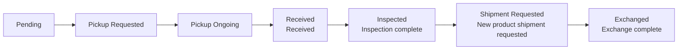

# Exchange Processing (Exchange)

An exchange is a claim in which the **original product is collected and a new product is sent**. Look them up via the **Order → Exchange List** menu on the left, and process them on the **EXCHANGE tab** of the order details. It is similar to a return, but with an added final step of **sending the new product**.

---

## Exchange Status Flow

| Status | Meaning | Available actions |
|------|------|-------------|
| **Pending** | Exchange received, awaiting pickup | Edit recipient, cancel |
| **Pickup Requested / Ongoing** | Collecting the original product | Edit recipient, cancel |
| **Received** | Original product received | Inspect (Refund Grading), cancel |
| **Inspected** | Inspection complete | Request shipment of new product (Request Shipment) |
| **Shipment Requested** | New product shipment in progress | (Wait) |
| **Exchanged** | New product sent | (Closed) |

---

## Choosing a Pickup Option When Registering an Exchange

On the order details screen, selecting **Register Claim → Claim Type = Exchange** also reveals a **Pickup Option** (Return behaves the same way). This option determines whether OMS sends a pickup (collection) instruction for the original product.

| Pickup Option | Behavior | When to use |
|---------------|----------|-------------|
| **Request Pickup** | Sends a pickup (collection) instruction. | Normal exchanges — when the original product needs to be collected |
| **Do Not Request Pickup** | Creates the exchange without a pickup. | When the item is already collected, or when the collection status can be received from the WMS |

If you choose **Do Not Request Pickup**, enter the **Tracking Information (Carrier and tracking number)** of the already-collected shipment. This is typically used when:

- The original item has already been manually received and processed in the WMS, and the exchange only needs to proceed system-side
- The customer shipped the item back themselves
- The received item differs from the requested one, so the original exchange is canceled and a new exchange is registered by re-selecting the received item

---

## Exchange Processing Steps

Expand the exchange card on the **EXCHANGE tab** of the order details screen to process it.

### 1. Collection Stage

- Collect the original product the same way as a return (Pickup Requested → Ongoing → Received).
- If the delivery address for the new product needs to change, edit it with **"Edit Recipient Info"**. (Only possible before shipment.)

### 2. Inspection (Refund Grading)

Once the original product is received and reaches **Received** status, inspect it.

<video controls width="100%" style={{maxWidth: '900px', borderRadius: '8px'}}>
  <source src="/oms_manual/video/iic_oms_exchange_grading.mov" />
  Your browser does not support the video tag.
</video>

1. Click the **"Refund Grading"** button.
2. Assign a **grade (A/B/C)** to each quantity of the collected product. (Grading criteria are the same as in [Return Inspection](./return#3-입고-확인-후-검수-및-환불-refund).)
3. Once you confirm the inspection, the status changes to **Inspected**.

### 3. Request Shipment of New Product (Request Shipment)

1. When the status becomes **Inspected**, the **"Request Shipment"** button appears.
2. Click it to request shipment of the **new product (Resend)**.
3. In the **Resend Shipment Information** of the EXCHANGE tab, you can check the new product's shipment number, tracking number, and status.
4. Once the new product has been sent, the status becomes **Exchanged**.

---

## Canceling an Exchange

You can cancel an exchange up until inspection begins.

1. On the EXCHANGE tab, click the **"Cancel Exchange"** button.
2. Cancelable statuses: **Pending / Pickup Requested / Pickup Ongoing / Received**
3. After **Inspected** (inspection complete, new product shipment in progress), it cannot be canceled.

You can also select multiple items in the **Exchange List** and cancel them at once with **"Bulk Cancel"**.

:::note
For responses to various exchange situations, see [Common Situations — Exchange Scenarios](../use-cases/exchange-scenarios).
:::
