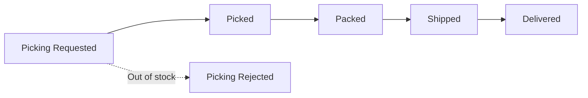

# Reshipment Processing (Reshipment)

A reshipment is **resending an item whose shipment failed or was lost**. The same product is sent again at no additional charge to the customer. Look them up via the **Order → Reshipment List** menu on the left, and process them on the **RESHIPMENT tab** of the order details.

---

## When Reshipment Occurs

| Cause | How it proceeds |
|-----------|-----------------|
| **Picking Rejected** | Shipment failed due to insufficient stock, etc. → reship after securing stock |
| **Delivery Lost (Lost)** | Lost during delivery → a new shipment is created when reshipment is chosen |

---

## Reshipment Status Flow

Reshipment follows the same status flow as a regular shipment.

---

## Reshipment Processing Steps

Expand the reshipment card on the **RESHIPMENT tab** of the order details screen to process it.

### Re-Ship

1. When the reshipment status is **Picking Rejected**, the **"Re-Ship"** button appears.
2. Click it to request shipment again with stock secured.

### Edit Recipient Info

If you need to change the delivery address or contact, use the **"Edit Recipient Info"** button.

### Cancel Reshipment

1. When the status is **Picking Requested**, you can cancel with the **"Cancel Reshipment"** button.
2. If the button shows **"(WMS Confirm needed)"**, it means the action requires warehouse (WMS) confirmation.

:::note
The full Picking Rejected → reshipment flow is covered step by step in [Common Situations — Shipment Rejection and Reshipment](../use-cases/shipment-rejection-reshipment).
:::
