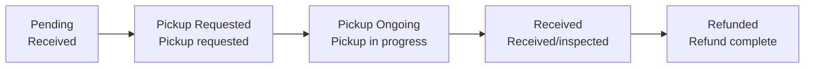

# Return Processing (Return)

A return is a claim in which the **product is collected and refunded**. Use the **Order → Return List** menu on the left to look up returns, and process individual items on the **RETURN tab** of the order details.

<video controls width="100%" style={{maxWidth: '900px', borderRadius: '8px'}}>
  <source src="/oms_manual/video/iic_oms_return.mov" />
  Your browser does not support the video tag.
</video>

---

## Return Status Flow

| Status | Meaning | Available actions |
|------|------|-------------|
| **Pending** | Return received, awaiting pickup | Request pickup, cancel |
| **Pickup Requested** | Pickup instruction sent | Cancel |
| **Pickup Ongoing** | Pickup in progress | Cancel |
| **Received** | Received and inspected | Refund (based on inspection grade) |
| **Refunded** | Refund complete | (Closed) |
| **Canceled** | Return canceled | (Closed) |

There are two **Return Methods**.

- **PARCEL**: Collected by courier (pickup instruction required)
- **IN_STORE**: Customer returns the item directly to a store

---

## Return Processing Steps

Expand the return card on the **RETURN tab** of the order details screen to process it.

### 1. Request Pickup

1. When the return status is **Pending**, click the **"Request Pickup"** button.
2. The pickup instruction is sent and the status changes to **Pickup Requested**.

### 2. Edit Recipient Info

If you need to change the pickup address or contact, use the **"Edit Recipient Info"** button. (Only possible before pickup is in progress.)

### 3. Inspection and Refund After Receipt (Refund) {#3-입고-확인-후-검수-및-환불-refund}

When the product arrives at the warehouse, the status becomes **Received**. At this point, assign an **inspection grade (Grade)** and then refund.

<video controls width="100%" style={{maxWidth: '900px', borderRadius: '8px'}}>
  <source src="/oms_manual/video/iic_oms_return_grading.mov" />
  Your browser does not support the video tag.
</video>

1. In the **Product Inspection Result** area of the RETURN tab, select a **grade for each quantity** of the collected product.

   | Grade | Meaning | Handling |
   |------|------|------|
   | **A** | Resalable (no issues) | Returned to normal inventory |
   | **B** | Minor defect | Sorted into a separate inventory pool |
   | **C** | Not sellable (damaged) | Disposed |

   - You can use the shortcut buttons (A/B/C) to apply the same grade at once, as well as a reset button.
2. You can only proceed with the refund once **a grade is assigned to every quantity**.
3. Click the **"Refund"** button to confirm the refund.

:::warning When you need to refund immediately without inspection
If a serious defect requires an immediate refund without inspection, process it as a **Force Refund**. Such items display a **"FORCE REFUND"** badge on the return card.
:::

---

## Canceling a Return

You can cancel a return as long as collection has not been completed.

1. On the RETURN tab, click the **"Cancel Return"** button.
2. Confirm to cancel the return.

- **PARCEL**: Can be canceled at the Pending / Pickup Requested / Pickup Ongoing stages
- **IN_STORE**: Can be canceled only at the Pending / Pickup Requested stages

---

## Bulk Cancel Multiple Items

In the **Return List**, you can select multiple returns and cancel them at once with **"Bulk Cancel"** (only items in a cancelable status). The procedure is the same as [Order Cancellation — Bulk Cancel](./order-cancel#방법-1--목록에서-여러-건-일괄-취소-bulk-cancel).

:::note
For complex situations such as partial inspection and partial refund, see [Common Situations — Partial Inspection Refund](../use-cases/partial-inspection-refund).
:::
