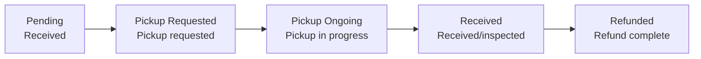

# Return Processing (Return)

A return is a claim in which the **product is collected and refunded**. Use the **Order → Return List** menu on the left to look up returns, and process individual items on the **RETURN tab** of the order details.

<video controls width="100%" style={{maxWidth: '900px', borderRadius: '8px'}}>
  <source src="/oms_manual/video/iic_oms_return.mov" />
  Your browser does not support the video tag.
</video>

---

## Return Status Flow

```mermaid
graph LR
    A[Pending<br/>Received] --> B[Pickup Requested<br/>Pickup requested]
    B --> C[Pickup Ongoing<br/>Pickup in progress]
    C --> D[Received<br/>Received/inspected]
    D --> E[Refunded<br/>Refund complete]
```

| Status | Meaning | Available actions |
|------|------|-------------|
| **Pending** | Return received, awaiting pickup | Request pickup, cancel |
| **Pickup Requested** | Pickup instruction sent | Cancel |
| **Pickup Ongoing** | Pickup in progress | Cancel |
| **Received** | Received and inspected | Refund (based on inspection grade) |
| **Refunded** | Refund complete | (Closed) |
| **Canceled** | Return canceled | (Closed) |

---

## Checking How a Return Was Registered (Pickup / Return Method)

The collection method differs depending on how the return was registered. The **Pickup** field and **Return Method** on the return details screen tell you which case it is.

| Registration case | Pickup | Return Method |
|-------------------|--------|---------------|
| **Force Refund** | `Not Requested` | `FORCE REFUND` |
| **Return + pickup not requested** | `Not Requested` | `PARCEL` |
| **Return + pickup requested** | `Requested` | `PARCEL` |
| **BORIS** (returned in store) | `Not Requested` | `IN STORE` |

- **Pickup**: Whether a pickup (collection) instruction was sent — `Requested` / `Not Requested`
- **Return Method**: How the item is collected — `PARCEL` (courier) / `IN STORE` (returned in store) / `FORCE REFUND` (forced refund with no collection)
- Force-refund items also show **`FORCE REFUND`** at the top of the return details, and **the forced-refund flag is included in the Excel export.**

---

## Choosing a Pickup Option When Registering a Return

On the order details screen, selecting **Register Claim → Claim Type = Return** also reveals a **Pickup Option** (Exchange behaves the same way). This option determines whether OMS sends a pickup (collection) instruction.

| Pickup Option | Behavior | When to use |
|---------------|----------|-------------|
| **Request Pickup** | Sends a pickup (collection) instruction. | Normal returns — when collection is required |
| **Do Not Request Pickup** | Creates the return without a pickup. | When the item is already collected, or when the collection status can be received from the WMS |

If you choose **Do Not Request Pickup**, enter the **Tracking Information (Carrier and tracking number)** of the already-collected shipment. This is typically used when:

- The item has already been manually received and processed in the WMS, and only a system-side refund is needed
- The customer shipped the item back themselves
- The received item differs from the requested one, so the original return is canceled and a new return is registered by re-selecting the received item

:::tip Do Not Request Pickup vs. Force Refund
Both create a return **without a pickup request**, but they differ in **whether the WMS return-processing status can be received**.

- **Can be received** → **Do Not Request Pickup** + Tracking Information (refund after receipt and inspection)
- **Cannot be received** → **Force Refund** (immediate refund without receiving WMS status)
:::

---

## Return Processing Steps

Expand the return card on the **RETURN tab** of the order details screen to process it.

### 1. Request Pickup

1. When the return status is **Pending**, click the **"Request Pickup"** button.
2. The pickup instruction is sent and the status changes to **Pickup Requested**.

### 2. Edit Recipient Info

If you need to change the pickup address or contact, use the **"Edit Recipient Info"** button. (Only possible before pickup is in progress.)

### 3. Inspection and Refund After Receipt (Refund) {#3-입고-확인-후-검수-및-환불-refund}

When the product arrives at the warehouse, the status becomes **Received**. At this point, assign an **inspection grade (Grade)** and then refund.

:::note
This applies only to Brand & Corps that run their own logistics without a WMS. When receipt information is received from a WMS, grading is confirmed automatically along with it.
:::

<video controls width="100%" style={{maxWidth: '900px', borderRadius: '8px'}}>
  <source src="/oms_manual/video/iic_oms_return_grading.mov" />
  Your browser does not support the video tag.
</video>

1. In the **Product Inspection Result** area of the RETURN tab, select a **grade for each quantity** of the collected product.

   | Grade | Meaning | Handling |
   |------|------|------|
   | **A** | Resalable (no issues) | Returned to normal inventory |
   | **B** | Minor defect | Sorted into a separate inventory pool |
   | **C** | Not sellable (damaged) | Disposed |

   - You can use the shortcut buttons (A/B/C) to apply the same grade at once, as well as a reset button.
2. You can only proceed with the refund once **a grade is assigned to every quantity**.
3. Click the **"Refund"** button to confirm the refund.

:::warning When you need to refund immediately without inspection
If a serious defect requires an immediate refund without inspection, process it as a **Force Refund**. Such items display a **"FORCE REFUND"** badge on the return card.
:::

---

## Lost Returns

When processing an item lost during delivery as a return, **select `Lost` as the return reason**.

- With a `Lost` return reason, the loss information is also sent to SAP and **handled in SAP's LOST warehouse**.
- It is therefore not booked as sales (−) / inventory (+) like a normal return, and operators no longer need to reconcile lost items manually.

:::note
For the procedure of marking a shipment as lost (mark Lost → choose force refund / reshipment), see [Shipment and Delivery Tracking — Handling Loss (Lost)](./shipment#분실lost-처리).
:::

---

## Canceling a Return

You can cancel a return as long as collection has not been completed.

1. On the RETURN tab, click the **"Cancel Return"** button.
2. Confirm to cancel the return.

- **PARCEL**: Can be canceled at the Pending / Pickup Requested / Pickup Ongoing stages
- **IN_STORE**: Can be canceled only at the Pending / Pickup Requested stages

---

## Bulk Cancel Multiple Items

In the **Return List**, you can select multiple returns and cancel them at once with **"Bulk Cancel"** (only items in a cancelable status). The procedure is the same as [Order Cancellation — Bulk Cancel](./order-cancel#방법-1--목록에서-여러-건-일괄-취소-bulk-cancel).

:::note
For complex situations such as partial inspection and partial refund, see [Common Situations — Partial Inspection Refund](../use-cases/partial-inspection-refund).
:::
