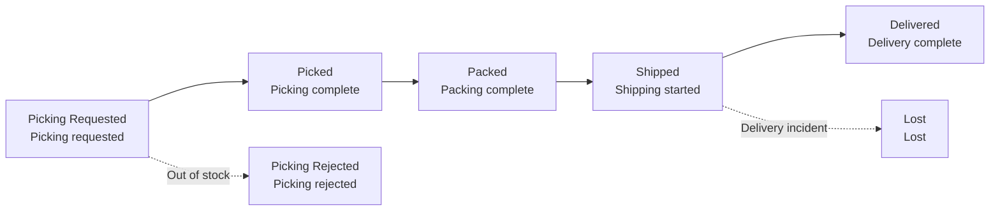

# Shipment and Delivery Tracking

Shipment is the process of picking, packing, and delivering products to the customer. The actual picking, packing, and delivery are performed by the warehouse (WMS), and the progress is passed to and displayed in the OMS.

---

## Fulfillment Status Flow

| Status | Meaning | What the operator should do |
|------|------|----------------|
| **Picking Requested** | Picking instruction sent to WMS | Shipment can be canceled if needed (WMS confirmation required) |
| **Picking Rejected** | Picking failed due to insufficient stock, etc. | Re-Ship or cancel the order |
| **Picked / Packed** | Picking/packing complete | Wait (cannot cancel) |
| **Shipped** | Shipping started (tracking number issued) | Track delivery; mark as lost if an incident occurs |
| **Delivered** | Delivery complete | Done. Return/exchange possible afterward |
| **Lost** | Lost during delivery | Force refund or reshipment |

The actions available for each status are summarized in the [Status Code Table](../reference/status-codes).

---

## Delivery Tracking

In the **Fulfillment Info** area of the order details ORDER tab, you can check the **Shipment No**, **Tracking No**, and **current fulfillment status**. The Tracking No column on the list screen also lets you check quickly.

Once a tracking number is issued (Shipped), it is also passed to the sales channel so customers can track delivery from their own order history.

---

## Handling Picking Rejected

When the warehouse rejects picking due to insufficient stock, etc., the fulfillment status becomes **Picking Rejected**. At this point you have two options.

- **Re-Ship**: Secure stock and ship again → [Reshipment](./reshipment)
- **Cancel the order**: Cancel if shipment is no longer possible → [Order Cancellation](./order-cancel)

---

## Handling Lost Shipments {#분실lost-처리}

Here is how to handle a product lost during delivery.

<video controls width="100%" style={{maxWidth: '900px', borderRadius: '8px'}}>
  <source src="/oms_manual/video/iic_oms_lost.mov" />
  Your browser does not support the video tag.
</video>

1. A loss can only be processed when the fulfillment status is **Shipped**.
2. Mark the shipment as **Lost**.
3. Then choose how to proceed.
   - **Reshipment**: Send the same product again (no additional charge to the customer)
   - **Force Refund**: Refund without resending

:::note
Step-by-step handling of lost shipments is covered in detail in [Common Situations — Delivery Lost](../use-cases/delivery-lost).
:::
