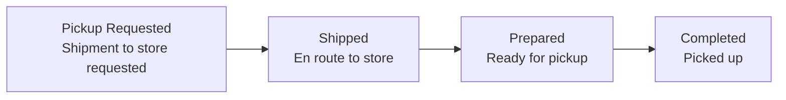

# Store Pickup (Store Pickup)

A store pickup is an order in which **the customer collects the product directly at a store**. Instead of courier delivery, the product is sent from the warehouse to the store, and the customer visits the store to pick it up.

In lists and details, the receive method is shown as a **purple "Store Pickup"** chip to distinguish it from regular delivery orders. You can view the overall status in the **Store Pickup** area of the dashboard's ORDER tab.

---

## Store Pickup Status Flow

| Status | Meaning | Cancelable |
|------|------|:---------:|
| **Pickup Requested** | Preparing the product to send to the store | ✅ |
| **Shipped** | Warehouse → store transfer complete | ✅ |
| **Prepared** | Arrived at store, awaiting customer pickup | ✅ |
| **Completed** | Customer has picked up | ❌ (Closed) |
| **Canceled** | Pickup canceled | ❌ (Closed) |

:::note
Store pickup has no courier tracking number. Instead of delivery tracking, progress is managed as **arrival at store (Shipped) → ready for pickup (Prepared) → picked up (Completed)**.
:::

---

## How to Process

Store pickup orders are looked up in the **Order List** and viewed by order number, just like regular orders.

- When searching, select **"Store Pickup" in the Receive Methods filter** to view only store pickup orders.
- You can also search by stage using the **store pickup status filter**.

### Cancellation

You can cancel a store pickup order as long as the customer has not picked it up (Completed). Cancel it from the details screen; cancellation triggers an automatic refund and returns the stock to inventory.

:::tip
The full operational scenario for store pickup is covered in [Common Situations — Store Pickup](../use-cases/store-pickup).
:::
