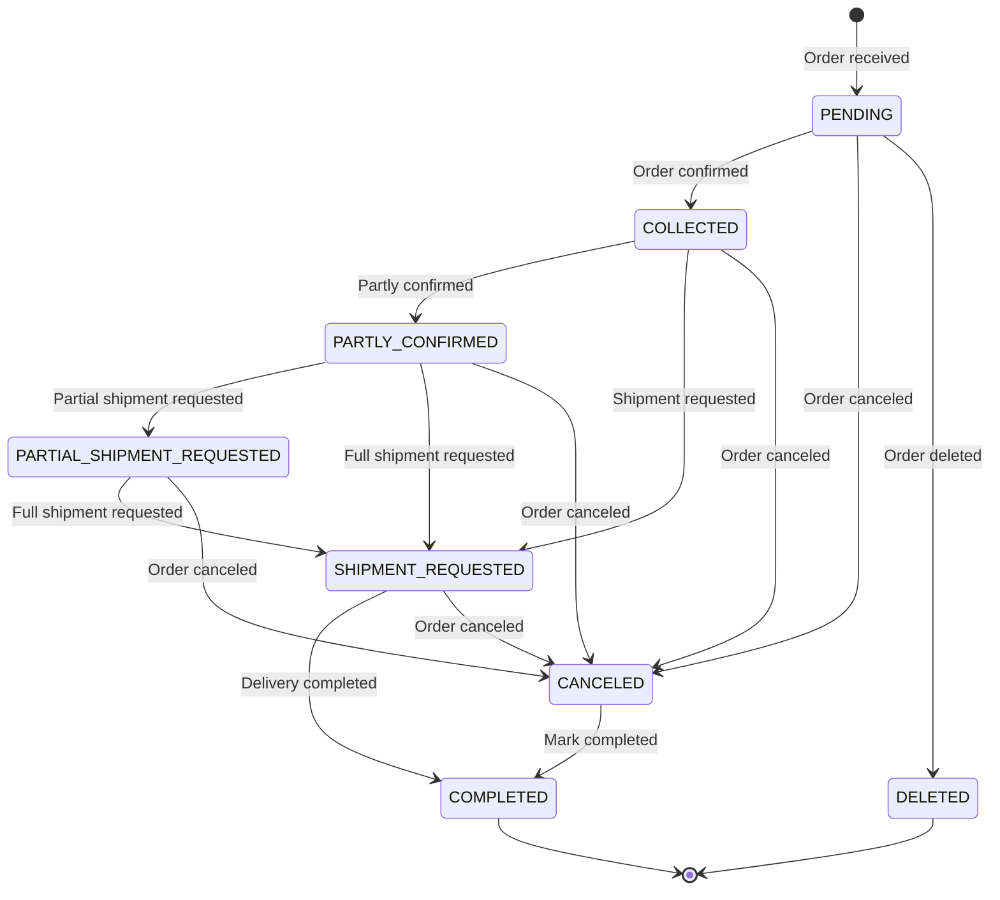

# Status Values / Code Tables

## Order Status Codes

| Status | Code | Description | Available Actions |
|--------|------|-------------|-------------------|
| Pending | PENDING | Order received, before confirmation | Confirm, cancel, delete, change recipient |
| Confirmed | COLLECTED | Order confirmed, stock allocation in progress | Request shipment, cancel, change recipient |
| Partly Confirmed | PARTLY_CONFIRMED | Only some items were allocated | Partial shipment, full shipment, cancel, change recipient |
| Partial Shipment Requested | PARTIAL_SHIPMENT_REQUESTED | Shipment requested for only some items | Request full shipment, cancel |
| Shipment Requested | SHIPMENT_REQUESTED | Shipment requested for all items | Complete, cancel |
| Canceled | CANCELED | Order canceled | Mark completed |
| Completed | COMPLETED | Order fully completed | - |
| Deleted | DELETED | Order deleted (only from PENDING) | - |

### Status Groups

| Group | Included Statuses | Description |
|-------|-------------------|-------------|
| Pending | PENDING | Orders not yet confirmed |
| In Progress | COLLECTED, PARTLY_CONFIRMED, PARTIAL_SHIPMENT_REQUESTED, SHIPMENT_REQUESTED | Orders currently being processed |
| Shipment In Progress | PARTIAL_SHIPMENT_REQUESTED, SHIPMENT_REQUESTED | Orders in the shipment phase |
| Final | COMPLETED, DELETED, CANCELED | Orders that can no longer transition |

---

## Shipment Status Codes

| Status | Code | Description | Possible Transitions |
|--------|------|-------------|----------------------|
| Picking Requested | PICKING_REQUESTED | Product picking requested to WMS | PICKED, PACKED, SHIPPED, DELIVERED, PICKING_REJECTED, CANCELED |
| Picked | PICKED | Product picked from the shelf | PACKED, SHIPPED, DELIVERED, PICKING_REJECTED, CANCELED |
| Packed | PACKED | Product packing completed | SHIPPED, DELIVERED, PICKING_REJECTED, CANCELED |
| Shipped | SHIPPED | Handed over to the carrier | DELIVERED, LOST |
| Delivered | DELIVERED | Delivered to the customer (final) | - |
| Picking Rejected | PICKING_REJECTED | Picking failed due to insufficient stock, etc. (final) | - |
| Canceled | CANCELED | Shipment canceled (final) | - |
| Lost | LOST | Lost during delivery (final) | - |

> **Note**: Some logistics centers process picking and packing together, so the PICKED step may be skipped.

---

## Return Status Codes

| Status | Code | Description | Available Actions |
|--------|------|-------------|-------------------|
| Pending | PENDING | Return created, before pickup | Request pickup, cancel, change recipient |
| Pickup Requested | PICKUP_REQUESTED | Pickup requested to carrier | Cancel, complete inspection |
| Pickup Ongoing | PICKUP_ONGOING | Pickup in progress | Cancel, complete inspection |
| Received | RECEIVED | Arrived at return center | Cancel, complete inspection, force complete |
| Refunded | REFUNDED | Refund completed (final) | - |
| Canceled | CANCELED | Return canceled (final) | - |

---

## Exchange Status Codes

| Status | Code | Description | Available Actions |
|--------|------|-------------|-------------------|
| Pending | PENDING | Exchange created, before pickup | Cancel, change shipping recipient |
| Pickup Requested | PICKUP_REQUESTED | Return pickup requested | Cancel, change shipping recipient, complete inspection |
| Pickup Ongoing | PICKUP_ONGOING | Return pickup in progress | Cancel, change shipping recipient, complete inspection |
| Received | RECEIVED | Returned product arrived | Cancel, complete inspection, force complete |
| Inspected | INSPECTED | Return inspection completed | Request exchange shipment |
| Shipment Requested | SHIPMENT_REQUESTED | Exchange product shipment | - (waiting for delivery progress) |
| Exchanged | EXCHANGED | Exchange product delivered (final) | - |
| Canceled | CANCELED | Exchange canceled (final) | - |

---

## Claim Type Codes

| Type | Code | Description | Created Domain |
|------|------|-------------|----------------|
| Cancel | CANCEL | Cancel order/item | - (handled directly from the order) |
| Return | RETURN | Product return -> refund | Return |
| Return Force Refund | RETURN_FORCE_REFUND | Special return -> immediate refund | Return |
| Exchange | EXCHANGE | Product return -> exchange shipment | Exchange |
| Reshipment | RESHIPMENT | Shipment failure -> ship again | Reshipment |

---

## Inspection Grade Codes

| Grade | Code | Meaning | Can Be Entered During Inspection |
|-------|------|---------|----------------------------------|
| A | A | Best condition | Yes |
| B | B | Good condition | Yes |
| C | C | Basic condition | Yes |
| Not Inspected | NONE | Initial status | No (system default) |
| Canceled | CANCEL | Assigned during force complete | No (system automatic) |

---

## Order Type / Received Method / Tag Codes

### Order Types

| Type | Code | Description |
|------|------|-------------|
| Normal | NORMAL | Standard order (default) |
| Gift | GIFT | Gift order |
| Prescription | RX | Special prescription-related order |

### Received Methods

| Method | Code | Description |
|--------|------|-------------|
| Delivery | ADDRESS_DELIVERY | Delivery to address (default) |
| Store Pickup | STORE_PICKUP | Customer picks up directly at a store |

### Order Tags

| Tag | Code | Description |
|-----|------|-------------|
| Preorder | PREORDER | Marked as a preorder |

---

## Carrier / Corporation Codes

### Carriers

| Carrier | Code | Trackable |
|---------|------|-----------|
| CJ Logistics | CJ | Yes |
| DHL | DHL | Yes |
| FedEx | FEDEX | Yes |
| UPS | UPS | Yes |
| Other | ETC | No |

### Corporations

| Corporation | Code | WMS Integration | Inspection Method |
|-------------|------|-----------------|-------------------|
| Korea | KR | Integrated | WMS automatic |
| Japan | JP | Integrated | WMS automatic |
| United States | US | Integrated | WMS automatic |
| Canada | CA | Not integrated | Manual (API) |
| Taiwan | TW | Not integrated | Manual (API) |
| Singapore | SG | Not integrated | Manual (API) |
| Australia | AU | Not integrated | Manual (API) |

---

## Stock Event Codes

| Event | Code | Description |
|-------|------|-------------|
| Online Stock Update | UPDATE_ONLINE_STOCK | Synchronize stock from ERP |
| Preorder Update | UPDATE_PREORDER | Change preorder quantity |
| Stock Transfer | TRANSFER | Move stock between channels |
| Order Created | CREATE_ORDER | Deduct stock through order creation |
| Order Canceled | CANCEL_ORDER | Restore stock through cancellation |
| Order Shipped | SHIP_ORDER | Confirm stock through shipment |
