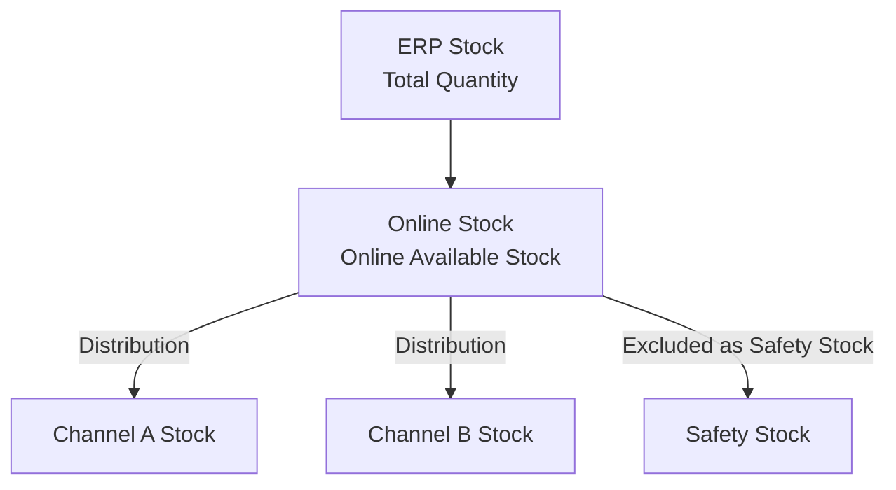

# Stock Overview

From the left menu **Stock → Overview**, you can review stock status by SKU and manage **safety stock** and **channel visibility (ON/OFF)**. Understanding how stock is structured first makes the numbers on the screen much easier to read.

---

## Understanding the Stock Structure

OMS stock is divided into two stages.

- **Online Stock**: The total available stock at the brand/corporation level, before it is distributed to channels.
- **Channel Stock**: The stock allocated to each sales channel. Actual sales are deducted from this stock.
- **Safety Stock**: The minimum quantity set aside to prevent stockouts. It is excluded from distribution and sales.

### Calculating Available Stock

The **Available** value on the screen (the sellable quantity) is calculated as follows.

> **Available = (Distributed + Pre-order) − (Used + Shipped)**

| Item | Meaning |
|------|------|
| **Distributed** | Quantity distributed to channels |
| **Pre-order** | Pre-order quantity |
| **Used** | Quantity reserved by orders in progress (Pending to Packed stages) |
| **Shipped** | Quantity that has been shipped/delivered |

:::warning
If Available appears as a **negative number (in red)**, the SKU is in an **Overselling** state. Check and adjust the stock immediately.
:::

---

## Reviewing Stock

Specify your conditions in the search form at the top.

| Filter | Description |
|------|------|
| **Channel** | Select multiple channels |
| **Product Type** | Single / Bundle |
| **Safety Stock Filter** | By safety stock (All / 1 or more / 0) |
| **Pre-order Stock Filter** | By pre-order (All / 1 or more / 0) |
| **Channel Send Status** | Channel visibility status (ON / OFF) |
| Search term | Search by SAP Code / SKU Code / SAP Name |

### Key Items in the List

The list is grouped and displayed under **Online Qty**, **Channel Qty**, **Stock Status**, and **Channel Send**.

| Item | Meaning |
|------|------|
| ERP / ERP Update | ERP-based quantity / changes reflected after the daily batch |
| Safety | Safety stock |
| Undistributed | Undistributed quantity |
| Distribution Ratio | Channel distribution ratio (%) |
| Distributed / Pre-order / Used / Shipped / Available | Channel stock details |
| **Stock Status** | `IN_STOCK` / `OUT_OF_STOCK` / `OVERSELLING` (in red) |
| **Channel Send Status** | `ON` (visible) / `OFF` (hidden) |

:::tip
Hover over each numeric item to see a tooltip explaining its calculation basis. For example, Used = "Allocated stock in use between Pending and Packed."
:::

---

## Changing Safety Stock

This task adjusts the buffer that prevents stockouts.

<video controls width="100%" style={{maxWidth: '900px', borderRadius: '8px'}}>
  <source src="/oms_manual/video/iic_oms_safety.mov" />
  Your browser does not support the video tag.
</video>

1. Select the SKU whose safety stock you want to change and open the edit (Edit) control in the **Safety** column.
2. In the **Change Safety Stock** modal, enter the safety stock quantity (0 or more).
3. Save with **"Save"**.

:::note
Increasing safety stock reduces the sellable quantity (Available) by the same amount. Use it to prevent stockouts and overselling of popular products.
:::

---

## Channel Send ON/OFF and Pre-order

| Task | How to |
|------|------|
| **Channel Send ON/OFF** | Turn channel visibility on or off in the Status column. When OFF, sales are stopped on that channel |
| **Off Period** | Schedule a start/end time to turn off visibility for a specific period only |
| **Pre-order Expired At** | Set the pre-order expiration date. If there is no expiration date, it is shown as "Indefinite" |

:::note To change the channel distribution ratio
To adjust the distribution ratio itself, go to [Distribution Setting](./distribution-setting).
:::
