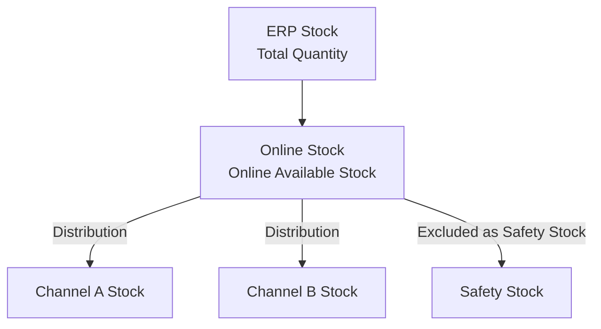

# Stock Overview

From the left menu **Stock → Overview**, you can review stock status by SKU and manage **safety stock** and **channel visibility (ON/OFF)**. Understanding how stock is structured first makes the numbers on the screen much easier to read.

---

## Understanding the Stock Structure

OMS stock is divided into two stages.

```mermaid
graph TD
    E[ERP Stock<br/>Total Quantity] --> O[Online Stock<br/>Online Available Stock]
    O -->|Distribution| C1[Channel A Stock]
    O -->|Distribution| C2[Channel B Stock]
    O -->|Excluded as Safety Stock| S[Safety Stock]
```

- **Online Stock**: The total available stock at the brand/corporation level, before it is distributed to channels.
- **Channel Stock**: The stock allocated to each sales channel. Actual sales are deducted from this stock.
- **Safety Stock**: The minimum quantity set aside to prevent stockouts. It is excluded from distribution and sales.

### Calculating Available Stock

The **Available** value on the screen (the sellable quantity) is calculated as follows.

> **Available = (Distributed + Pre-order) − (Used + Shipped)**

| Item | Meaning |
|------|------|
| **Distributed** | Quantity distributed to channels |
| **Pre-order** | Pre-order quantity |
| **Used** | Quantity reserved by orders in progress (Pending to Packed stages) |
| **Shipped** | Quantity that has been shipped/delivered |

:::warning
If Available appears as a **negative number (in red)**, the SKU is in an **Overselling** state. Check and adjust the stock immediately.
:::

---

## Reviewing Stock

Specify your conditions in the search form at the top.

| Filter | Description |
|------|------|
| **Channel** | Select multiple channels |
| **Product Type** | Single / Bundle |
| **Safety Stock Filter** | By safety stock (All / 1 or more / 0) |
| **Pre-order Stock Filter** | By pre-order (All / 1 or more / 0) |
| **Channel Send Status** | Channel visibility status (ON / OFF) |
| Search term | Search by SAP Code / SKU Code / SAP Name |

### Key Items in the List

The list is grouped and displayed under **Online Qty**, **Channel Qty**, **Stock Status**, and **Channel Send**.

| Item | Meaning |
|------|------|
| ERP / ERP Update | ERP-based quantity / changes reflected after the daily batch |
| Safety | Safety stock |
| Undistributed | Undistributed quantity |
| Distribution Ratio | Channel distribution ratio (%) |
| Distributed / Pre-order / Used / Shipped / Available | Channel stock details |
| **Stock Status** | `IN_STOCK` / `OUT_OF_STOCK` / `OVERSELLING` (in red) |
| **Channel Send Status** | `ON` (visible) / `OFF` (hidden) |

:::tip
Hover over each numeric item to see a tooltip explaining its calculation basis. For example, Used = "Allocated stock in use between Pending and Packed."
:::

---

## Changing Safety Stock

This task adjusts the buffer that prevents stockouts.

<video controls width="100%" style={{maxWidth: '900px', borderRadius: '8px'}}>
  <source src="/oms_manual/video/iic_oms_safety.mov" />
  Your browser does not support the video tag.
</video>

1. Select the SKU whose safety stock you want to change and open the edit (Edit) control in the **Safety** column.
2. In the **Change Safety Stock** modal, enter the safety stock quantity (0 or more).
3. Save with **"Save"**.

:::note
Increasing safety stock reduces the sellable quantity (Available) by the same amount. Use it to prevent stockouts and overselling of popular products.
:::

---

## Channel Send ON/OFF and Pre-order

| Task | How to |
|------|------|
| **Channel Send ON/OFF** | Turn channel visibility on or off in the Status column. When OFF, sales are stopped on that channel |
| **Off Period** | Schedule a start/end time to turn off visibility for a specific period only |
| **Pre-order Expired At** | Set the pre-order expiration date. If there is no expiration date, it is shown as "Indefinite" |

:::note To change the channel distribution ratio
To adjust the distribution ratio itself, go to [Distribution Setting](./distribution-setting).
:::

---

## Stock Transfer

### 1. Feature Overview

Stock Transfer moves stock between **Undistributed Qty** and **channel Available Qty**.

| Direction | Meaning |
| --- | --- |
| `Undistributed → Available` | Pushes stock that has not yet been distributed down to a specific channel's sellable stock (adding stock) |
| `Available → Undistributed` | Pulls a channel's sellable stock back into undistributed stock (reclaiming stock) |

There are only two key concepts to remember.

- **Undistributed Qty is a shared pool at the SKU level.** If you select multiple channel rows for the same SKU, they all draw from that single pool.
- **Available Qty is stock at the channel level.** When reclaiming, you can only deduct up to the quantity that channel holds.

> ⚠️ On **Save**, the stock is reflected to the channel **immediately**. There is no separate approval or scheduling step.

---

### 2. Prerequisites

| Condition | Details |
| --- | --- |
| Search required | The button only appears once you have run **Search** in the filter and the result grid is displayed |
| Product Type | All selected items must be **`Single`**. If even one `Bundle` is included, you cannot proceed |
| Selection unit | Select by **channel row checkbox**, not by product row |
| Channel Send Status | Stock Transfer is **not restricted** for `OFF` channels |
| Multiple channels | You may select several channels at once (no limit) |

---

### 3. How to Use

#### Step 1. Search for the target stock

1. Go to **Stock > Overview** → click the **Channel Stock Setting** tab at the top
2. Enter your conditions in the search filter
   - `Product Type` defaults to **Single**. If you plan to use Stock Transfer, leave it as is.
   - Search for the product by `SAP Code`, `SKU Code`, or `SAP Name`
   - Use the Channel, Channel Send Status, and Pre-order/Safety filters as needed
3. Click **Search** → the result grid is displayed

#### Step 2. Select channel rows

- Use the **checkboxes** to the left of the `Channel` area in the grid to check the channel rows you want to transfer.
- Clicking the header checkbox selects **all channel rows** on the current page at once (excluding the `Total` row).
- ⚠️ **Running Search again or moving to another page clears your selection.** Select the rows and click the button right away.

#### Step 3. Open the Stock Transfer modal

Click the **`Stock Transfer`** button at the top right of the result grid.

#### Step 4. Choose the Transfer Direction

Pick the direction from the toggle at the top right of the modal. It applies to **every row in the modal at once**.

- `Undistributed → Available` (default)
- `Available → Undistributed`

> ⚠️ Changing the direction **clears every Move Qty you have entered**. Decide the direction first, then enter the quantities.

#### Step 5. Enter Move Qty

Enter the quantity to move in each row's **Move Qty** field.

- Only numbers can be entered (letters and symbols are removed automatically)
- Rows left blank or set to `0` are **excluded from the transfer**
- In the `Available → Undistributed` direction, you can check **how much can actually be moved** in the `Transferable` value.
  - `Transferable Qty = {Available - PreOrder} Qty`
  - *Quantities entered as pre-order are virtual stock and cannot be moved*
- **`Max` button**: automatically fills in the maximum quantity allowed for that row
  - `Undistributed → Available`: `Undistributed Qty − the total already entered on other rows for the same SKU`
  - `Available → Undistributed`: that channel's `Transferable Qty`
- **`Max All` button**: fills the maximum quantity into the Move Qty field of every product at once.

#### Step 6. Save

Do a final check at the bottom of the modal and click **`Save`**.

Information area at the bottom

- `Transfer Row`: the number of rows that will actually be transferred (quantity > 0 and no errors)
- `FROM ○○○ → TO ○○○` badge: the source and destination for the current direction
- Warning when everything is valid: `⚠ Clicking 'Save' will instantly move the stock.`
- Warning when there are errors: `⚠ Some rows exceed the remaining stock.`

Click `Save` → a confirmation popup appears

> `The data being saved will be immediately transferred to the channel. Continue?`
> - **Continue**: run the transfer
> - **Leave without saving**: close without saving

On success, a snackbar is shown and the grid refreshes automatically.
> `Update Successful — Your changes have been successfully applied.`

#### Step 6-1. When the Save button is disabled

- When there is **at least one** row with an error
- When there are **zero** rows to transfer (all rows are blank or 0)
