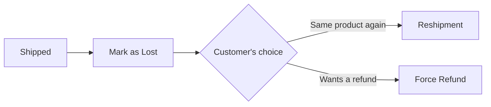

# Delivery Lost

> **Situation**: A shipped product is lost in transit and never arrives at the customer.

## Response Sequence

1. **Check the shipment status** — Lost processing is only possible when the shipment status is **Shipped**.
2. **Mark as Lost** — On the order detail page, mark the relevant shipment as lost. ([Shipment & Delivery Tracking — Lost Handling](../order/shipment#분실lost-처리))
3. **Choose the follow-up action**
   - **Reshipment**: Send the same product again, at no extra cost to the customer → [Reshipment Processing](../order/reshipment)
   - **Force Refund**: Refund immediately without re-sending
## Checkpoints

- A lost delivery is generally handled as an **operational fault (OPERATION)**.
- Reshipment is not possible without stock, so check inventory first and, if there is none, guide the customer toward a force refund.
