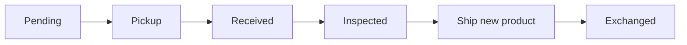

# Exchange Scenarios

> **Situation**: A customer requests an exchange because the size/color doesn't fit or the item is defective.

An exchange proceeds in the order **collect the original product → inspect → send the new product**. For detailed screen operations, see [Exchange Processing](../order/exchange).

## Standard Exchange (Size/Color Change)

1. Pickup request → the original product is received (**Received**)
2. Inspect with **Refund Grading** (A/B/C) → **Inspected**
3. Send the new product with **Request Shipment** → **Exchanged**

## Defective Exchange (Operational Fault)

- Handle the fault as **OPERATION**.
- The exchange can proceed even if the collected product is clearly defective (grade C).

## When You Need to Cancel an Exchange

- Before inspection begins (**Pending / Pickup Requested / Pickup Ongoing / Received**), it can be cancelled with **"Cancel Exchange"**.
- After **Inspected**, it cannot be cancelled. In that case, proceed with sending the new product, or settle it separately through a return/refund.

## When the New Product Is Out of Stock

If the new exchange product is out of stock, picking may be rejected when you request the shipment. Secure the stock, or coordinate with the customer to convert it into a refund (return).
