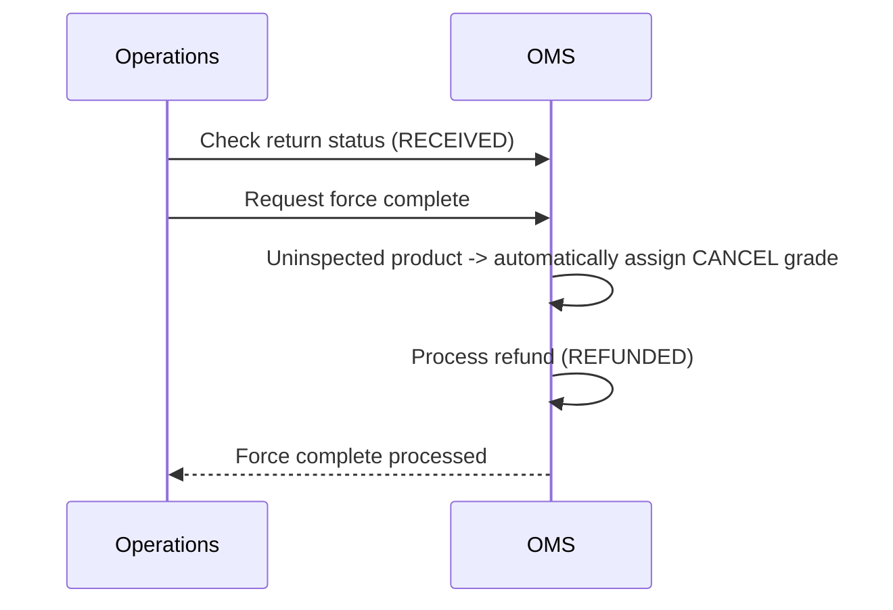

# Partial Inspection and Refund Scenario

## Situation

Out of three returned products, only two can be inspected and the remaining one is difficult to process.

## Processing Methods

### Method 1: Refund After Completing Full Inspection

Assign grades to all returned products, then process the refund.

1. Return detail -> click **Complete Inspection**.
2. Enter grade by product:
   - Product A: grade `A` (best condition)
   - Product B: grade `B` (good)
   - Product C: grade `C` (basic)
3. Complete inspection for all products -> proceed with refund (`REFUNDED`)

> **Caution**: The inspection quantity must exactly match the return quantity. If any product is missing, the `All items must be inspected` error occurs.

### Method 2: Force Complete When Some Products Cannot Be Inspected

Use force complete when there are products that cannot be inspected.

1. Confirm that the return status is `Received (RECEIVED)`.
2. Click **Force Complete**.
3. Uninspected products are automatically processed with the `CANCEL` grade.
4. Refund proceeds normally.

> **Force complete is only available in `Received (RECEIVED)` status.** In other statuses, the force complete button is disabled.

## Meaning of Inspection Grades

| Grade | Meaning | Input Method |
|-------|---------|--------------|
| A | Best condition, resale available | Manual operator input |
| B | Good, slight signs of use | Manual operator input |
| C | Basic, visible signs of use | Manual operator input |
| NONE | Not inspected (initial status) | System default |
| CANCEL | Inspection canceled (during force complete) | System automatic |

## Partial Inspection for Exchanges

Exchange cases follow the same inspection process.

- Inspection can be completed when exchange status is `RECEIVED`
- After all products are inspected -> status changes to `INSPECTED` -> exchange shipment request becomes available
- On force complete -> uninspected products receive the `CANCEL` grade and the exchange is completed (`EXCHANGED`)

## Key Points

- Inspection must be processed for **all products**. Completing with only some products inspected is not allowed.
- If some products are difficult to inspect, process with **Force Complete**.
- Products force-completed with the `CANCEL` grade are also included in the refund target.
- In WMS-integrated corporations, inspection results are delivered automatically, so manual inspection is not allowed.
