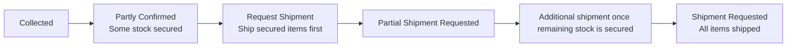

# Partial Shipment / Split Delivery (Partial Shipment)

> **Situation**: Only some of the multiple products in an order are in stock, so you ship the available ones first and send the rest later.

## Response Sequence

1. The order enters the **Partly Confirmed** (only partially allocated) status.
2. On the ORDER tab of the order detail page, use **"Request Shipment"** to ship the secured products first. ([Partial Shipment Request](../order/order-cancel#부분-출고-요청))
3. The order becomes **Partial Shipment Requested**, and the remaining products are shipped as soon as stock is secured.
4. Once all products are shipped, the order becomes **Shipment Requested**.

## Checkpoints

- In the **Partial Shipment Requested** status, **only the unshipped portion** can be cancelled (already-shipped products cannot be cancelled).
- If the remaining products cannot be secured for an extended period, consider cancelling the unshipped portion and offering a refund.
