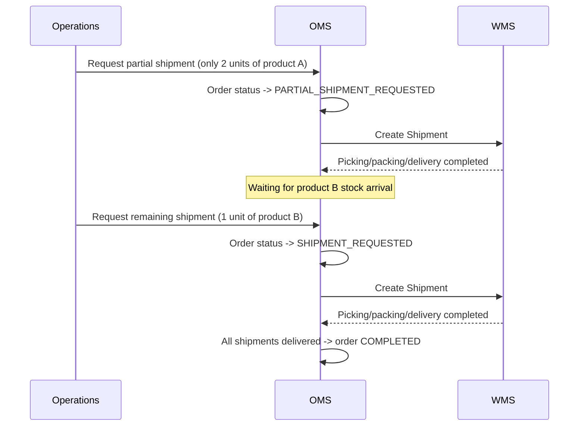

# Partial Shipment / Split Delivery Scenario

## Situation

A customer ordered two units of product A and one unit of product B, but only product A has stock.

## Processing Flow

## Key Points

- One order can be split into multiple Shipment cases
- All shipments must become `Delivered (DELIVERED)` before the order becomes `Completed (COMPLETED)`
- When partial shipment is requested, the shippable quantity of remaining items is calculated automatically
