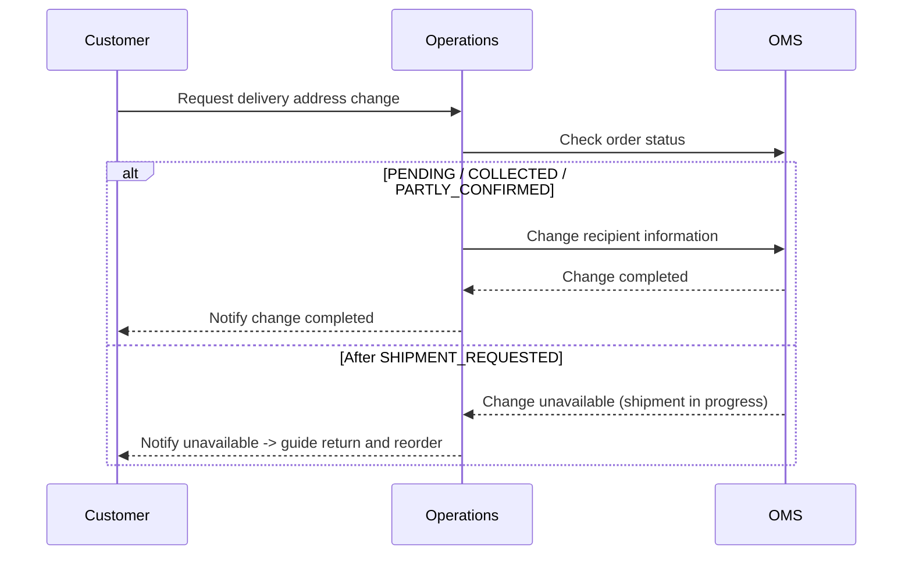

# Recipient Change Restriction Scenario

## Situation

A customer requests a delivery address or recipient information change.

## Conditions for Changes

Recipient changes are only available **before shipment starts**.

| Domain | Change Available Statuses | Change Unavailable Statuses |
|--------|---------------------------|-----------------------------|
| Order recipient | `PENDING`, `COLLECTED`, `PARTLY_CONFIRMED` | After `SHIPMENT_REQUESTED` |
| Return pickup address | `PENDING` | After `PICKUP_REQUESTED` |
| Exchange shipping recipient | `PENDING`, `PICKUP_REQUESTED`, `PICKUP_ONGOING` | After `RECEIVED` |

## Processing Flow

### Order Recipient Change

### Return Pickup Address Change

- Only available in `Pending (PENDING)` status
- After the pickup request is sent to the carrier, changing the address can cause mismatch with carrier information

### Exchange Shipping Recipient Change

- The delivery address for exchange products can be changed in `PENDING`, `PICKUP_REQUESTED`, and `PICKUP_ONGOING` statuses
- After inspection completion (`RECEIVED`), the case enters the shipment phase and changes are unavailable

## Key Points

- If recipient change is needed after shipment starts, guide the customer to **return and reorder**
- Information already sent to the carrier cannot be changed in OMS
- Recipient changes are automatically recorded in order history
