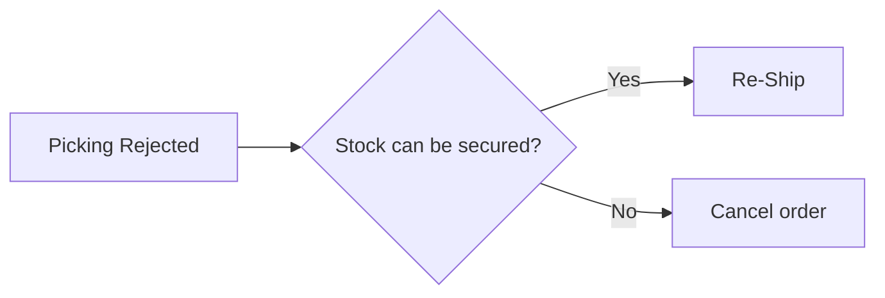

# Shipment Rejection & Reshipment (Picking Rejected → Reshipment)

> **Situation**: Picking was rejected at the warehouse (e.g., due to insufficient stock), so the shipment failed.

## Response Sequence

1. **Check the status** — Confirm that the shipment status is **Picking Rejected**.
2. **Check inventory** — In [Stock Overview](../stock/overview), check the available stock for the relevant SKU.
3. **Choose the action**
   - If stock is available → **"Re-Ship"** from the **RESHIPMENT tab** of the order detail page ([Reshipment Processing](../order/reshipment))
   - If stock is unavailable → close out with an [Order Cancellation](../order/order-cancel) and notify the customer

## Checkpoints

- If picking is repeatedly rejected for the same SKU, there may be an inventory data mismatch. → [Inventory Mismatch / Sync Delay](./inventory-mismatch-sync-delay)
- An excessive Safety Stock setting can make available stock appear insufficient, so check it as well.
