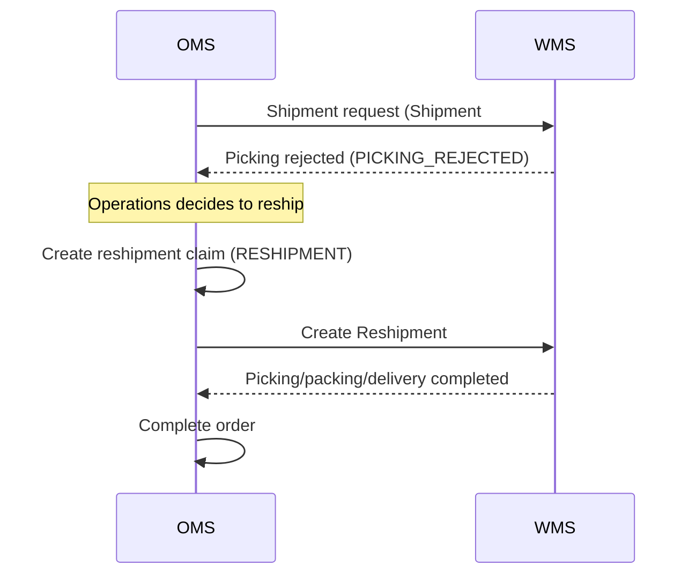

# Shipment Rejection -> Reshipment Scenario

## Situation

WMS rejected picking due to a stock mismatch.

## Processing Flow

> **Reshipment Feature Expansion (OMS-1998)**: Shipment cancellation, loss handling, and rejection-related features were added for reshipments as well. If a reshipment is lost during delivery, it transitions to `LOST`, and a reshipment claim can be registered again.
