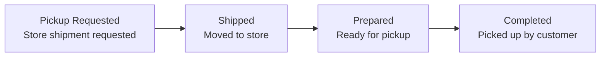

# Store Pickup Operations (Store Pickup)

> **Situation**: A customer places an order for store pickup. You need to manage the progress from warehouse → store → customer pickup.

## Process Flow

1. When an order comes in, the warehouse sends the product to the store (**Pickup Requested**).
2. Once it arrives at the store, it progresses **Shipped → Prepared** (ready for pickup).
3. When the customer picks it up at the store, it becomes **Completed**.

## Operator Tips

- In **Order List**, filter by **Receive Methods = Store Pickup** to view only store pickup orders together.
- Check the stage-by-stage status in the **Store Pickup** area of the dashboard's ORDER tab.
- If the customer wants to cancel **before pickup (Completed)**, cancel it on the order detail page (automatic refund and stock return).

For a detailed screen description, see [Store Pickup](../order/store-pickup).
